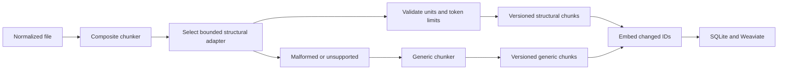

# ADR-001: Language-Aware Structural Chunking

Status: Accepted
Date: 2026-07-21
Related Features: [FEATURE-01](../04-FEATURE/FEATURE-01-LANGUAGE-AWARE-STRUCTURAL-CHUNKING.md)
Decision review: Approved by the configured `solution-architect` agent on 2026-07-21 after two mandatory correction rounds covering profile cutover, migrations, evaluation reproducibility, and profile-bound chunk identity.
Implementation amendment review: Approved by the configured `solution-architect` agent on 2026-07-21 after final review of full generic-profile fingerprinting, Python lexical/span masking, rollback/cutover behavior, provenance-bound evaluation, and the bounded Feature 01 performance exception.

---

## Implementation plan (step-by-step)

- [x] Analyze the current generic line-window chunker, chunk contract, SQLite schema, Weaviate schema, and indexing flow.
- [x] Select the Phase 2 language corpus, parser boundary, provenance contract, version transition, and evaluation thresholds.
- [x] Implement additive chunk metadata and persistence/schema migration.
- [x] Implement the structural chunker selector, approved adapters, deterministic oversized-unit splitting, and generic fallback.
- [x] Add golden fixtures, persistence/search tests, malformed-input tests, stable-identity tests, and retrieval evaluation.
- [x] Run build, test, format, real ONNX, live Weaviate, and retrieval-evaluation commands; record results.
- [x] Update FEATURE-01, PLAN-02, supported-language/configuration docs, and this ADR with final evidence.

---

## Context

- The host currently injects one `IChunker`, and `GenericChunker` creates overlapping line windows using an estimated four characters per token. It records language and line bounds but leaves `SymbolName` null.
- `ChunkRecord`, SQLite `Chunks`, and Weaviate `RagChunk_v1` do not yet record chunk kind, qualified symbol, structural locator, or chunker identity/version.
- `FileIndexingService` embeds only chunk IDs not present in prior state, so stable versioned identities are required to prevent unnecessary embeddings and to force deliberate transition work when semantics change.
- Phase 2 must improve code and configuration retrieval without introducing compiler-grade semantics, Tree-sitter dependency analysis, a new embedding model, or a new vector-store owner.
- Extracted content is untrusted. Parser output must never affect authorization, filesystem scope, or executable behavior.

Goals:

- Preserve complete structural units when they fit the model limit and split oversized units deterministically.
- Add stable, searchable structural provenance while retaining exact line bounds.
- Cover the repository's current developer-language and structured-text surface with bounded in-process adapters.
- Fall back to generic line-preserving chunks on unsupported or malformed input without dropping searchable content.
- Prove a measurable retrieval improvement against the generic baseline without accepting per-language regressions.

Non-goals:

- Compiler binding, type resolution, call/dependency graphs, parent-child retrieval, Git metadata, or arbitrary syntax-tree queries.
- New document extractors, embedding profiles, remote parsing services, or direct parser access from REST/MCP adapters.

---

## Stakeholders (who needs this to be clear)

| Role | What they need to know | Questions this ADR answers |
| --- | --- | --- |
| Product / Owner | Supported Phase 2 corpus and measurable quality gate | Which languages improve, and what counts as success? |
| Engineering | Parser boundary, identity, persistence, fallback, and migration | What changes, where, and how are mixed versions avoided? |
| DevOps / SRE | Reindex behavior, bounded resource use, and diagnostics | How is the transition operated and repaired? |
| QA | Golden fixtures, negative/edge cases, and judged corpus | Which automated evidence proves the decision? |

---

## Decision

Implement deterministic, lightweight, in-process structural chunkers behind a selector/composite, with `GenericChunker` as the mandatory fallback; version all emitted provenance and require a controlled reindex when the active chunking profile changes.

Key points:

- Phase 2 corpus: C#, TypeScript/TSX, JavaScript/JSX, Python, Markdown, JSON, YAML, TOML, and XML-family files (`.xml`, `.csproj`, `.props`, `.targets`).
- C#, TypeScript/JavaScript, and Python adapters identify module/type/function/member units using bounded lexical state machines that ignore strings/comments and balance language delimiters/indentation. They do not claim compiler semantics.
- Markdown chunks by heading section. JSON chunks by top-level property/object boundaries. YAML and TOML chunk by document/table or top-level key sections. XML-family files chunk by top-level element sections.
- Every adapter implements an internal `IStructuralChunker` contract with `Supports`, stable `ChunkerId`, semantic `ChunkerVersion`, and `TryChunk`. A `CompositeChunker` remains the sole application-facing `IChunker`.
- Any unsupported extension, malformed structure, invalid bounds, adapter exception, or unusable result invokes `GenericChunker`; the failure is classified and recorded without content or absolute paths.
- `ChunkRecord` gains additive `ChunkKind`, `QualifiedSymbolName`, `StructuralLocator`, `ChunkerId`, `ChunkerVersion`, and `ChunkProfileFingerprint` fields. `SymbolName` and `QualifiedSymbolName` remain nullable for generic/configuration chunks.
- Structural identity is SHA-256 over source ID, normalized relative path, structural locator, normalized chunk content, chunker ID, chunker version, and the canonical chunk-profile fingerprint. Continuations append a deterministic segment locator. Identical input under the same fingerprint reuses IDs; any fingerprint change necessarily creates new IDs and forces vector upsert plus stale-ID deletion.
- Generic chunks use `ChunkKind=text`, locator `lines:{start}-{end}`, `ChunkerId=generic`, and `ChunkerVersion=1`. `generic/1` is the canonical chunker identity, not the complete configuration fingerprint.
- SQLite adds `ChunkKind TEXT NOT NULL DEFAULT 'text'`, `QualifiedSymbolName TEXT NULL`, `StructuralLocator TEXT NOT NULL DEFAULT ''`, `ChunkerId TEXT NOT NULL DEFAULT 'generic'`, `ChunkerVersion TEXT NOT NULL DEFAULT '1'`, and `ChunkProfileFingerprint TEXT NOT NULL DEFAULT 'legacy-generic-1'`. The migration backfills an empty locator as `lines:{StartLine}-{EndLine}` before enforcing application-level non-empty validation.
- Weaviate adds `chunkKind` (`text`, filterable, searchable), `qualifiedSymbolName` (`text`, filterable, searchable), `structuralLocator` (`text`, filterable, not searchable), `chunkerId` (`text`, filterable, not searchable), `chunkerVersion` (`text`, filterable, not searchable), and `chunkProfileFingerprint` (`text`, filterable, not searchable). Readiness idempotently adds missing compatible properties before validation; an existing property with the wrong type remains a hard failure.
- The canonical chunk-profile fingerprint is lowercase SHA-256 over UTF-8 canonical JSON containing: profile schema version; the canonical chunker identity (`generic/1` when adapters are disabled); enabled adapter IDs sorted ordinally; every adapter ID/version sorted ordinally; generic chunker ID/version; target, maximum, and overlap token settings; embedding profile/tokenizer identity; query and passage prefixes; and the hard model token limit. Equivalent configuration produces the same fingerprint on every platform. Generic-only settings therefore retain the `generic/1` chunker identity while still changing the full fingerprint whenever vector or chunk-boundary semantics change.
- SQLite persists one row per source in `SourceChunkProfiles` with `SourceId`, `ActiveFingerprint`, nullable `PendingFingerprint`, `State` (`Ready`, `Reindexing`, `Failed`), `RequestedUtc`, and nullable `CompletedUtc`/`LastError`. Index jobs persist the target fingerprint and a force-content-processing flag.
- A fingerprint mismatch creates a forced full-source reindex. The forced path bypasses both `FileIndexingService.IndexAsync` short circuits: unchanged size/timestamp and unchanged extracted-content hash. Normal same-profile reconciliation retains both optimizations.
- A transitioning source is excluded from all search/chunk retrieval surfaces from the durable `Reindexing` transition until every eligible file and stale-vector deletion succeeds and the active fingerprint flips atomically in SQLite. Restart or failure keeps the source excluded and degraded; rollback is another forced transition to the full fingerprint whose canonical chunker identity is `generic/1`. This deliberately trades temporary source availability for a simple no-mixed-profile query guarantee.
- Existing BGE Small English v1.5 limits remain authoritative. All adapters use the shared tokenizer/limit boundary; character estimates may guide scanning but cannot be the final hard-limit proof.
- The judged corpus contains exactly eight reported families for the minimum gate: C#; TypeScript/JavaScript; Python; Markdown; JSON; YAML; TOML; and XML-family. Each family has at least four queries, for at least 32 total. Judgments identify relevant source-relative path plus line span/symbol intent so the same judgments apply to different chunk boundaries.
- Baseline and candidate runs use identical source files, queries, judgments, BGE embedding profile/revision, tokenizer, Weaviate version, hybrid mode (`alpha=0.65`), filters, limit 10, and clean isolated collections. Metrics are computed by a checked-in deterministic evaluator; equal-score results tie-break by chunk ID ordinally. A retrieved chunk is relevant when its source/path matches and its line interval overlaps a judged relevant interval. The report records paired per-query and per-family Recall@10, reciprocal rank, and nDCG@10 for `generic/1` and the candidate fingerprint.
- Acceptance thresholds: aggregate Recall@10 at least 0.85, aggregate MRR@10 at least 0.75, aggregate nDCG@10 at least 10% above the generic baseline, and no language-family nDCG@10 regression greater than 0.02. Warm indexing throughput and memory must remain within the PLAN-02 bounds or receive an explicit reviewed exception.

---

## Diagram

---

## Alternatives considered

### Compiler APIs and Tree-sitter parsers for the full corpus

- Pros: richer syntax fidelity and fewer hand-written lexical rules.
- Cons: larger native/package matrix, language-specific runtime dependencies, versioning complexity, and overlap with Phase 3 compiler/Tree-sitter scope.
- Rejected because: Phase 2 needs deterministic structural retrieval and safe fallback, not compiler-grade semantics or a new cross-platform native dependency surface.

### Keep only `GenericChunker` and enrich it with regular expressions

- Pros: smallest code and migration footprint.
- Cons: cannot reliably preserve nested units, produces weak locators, and does not create a clean adapter/version boundary.
- Rejected because: it does not satisfy FEATURE-01 structural-unit or provenance requirements.

### Start with C# only

- Pros: fastest initial implementation and easiest high-quality fixtures.
- Cons: leaves the extension's existing TypeScript/JavaScript, Python, documentation, and configuration surface on the old behavior and weakens the phase-level retrieval-quality claim.
- Rejected because: the approved Phase 2 scope is a representative developer repository corpus, not a single-language pilot.

---

## Consequences

### Positive

- Structural provenance becomes explicit, additive, testable, and consistent across SQLite, Weaviate, REST, and MCP.
- Adapters remain replaceable without changing the application-facing indexing contract.
- Generic fallback preserves availability and line mapping when structural parsing is unsafe.
- Versioned identities make reindex transitions observable and prevent silent semantic mixing.

### Negative / risks

- Lightweight lexical parsers will not understand every legal language construct.
  - Mitigation: conservative validation, golden fixtures, bounded state machines, and whole-file generic fallback on ambiguity.
- Additive SQLite and Weaviate properties require migration and repair handling.
  - Mitigation: idempotent schema migration, explicit readiness validation, legacy generic defaults, and controlled reindex.
- The broader corpus increases test and maintenance cost.
  - Mitigation: one shared unit model, adapter conformance tests, small language-family fixtures, and versioned behavior.
- Structural reindex can consume significant embedding time.
  - Mitigation: explicit operator-visible transition, bounded jobs, unchanged-ID reuse where identities remain equal, and live recovery evidence.

---

## Impact

### Code

- Affected modules/services: `Application/Contracts.cs`, `Domain/Models.cs`, `Infrastructure/Processing`, `Infrastructure/Indexing/FileIndexingService.cs`, SQLite state, Weaviate vector store, REST/search result contracts, and tests.
- New boundaries/responsibilities: internal `IStructuralChunker`, structural-unit validation/token enforcement, `CompositeChunker`, and chunk-profile compatibility service.
- Feature flags/toggles: per-adapter enablement under chunking configuration, default enabled for the approved corpus; generic fallback cannot be disabled.

### Data / configuration

- Data model/schema changes: six additive chunk provenance fields plus `SourceChunkProfiles` and target-fingerprint/force fields on durable index jobs.
- Config changes: adapter enablement and active profile version; no secrets.
- Backwards compatibility strategy: additive API fields, legacy rows treated as `generic/1`, schema migration before Ready, and explicit full reindex before structural profile activation.

### Documentation

- Feature docs to update: FEATURE-01 and PLAN-02 evidence/status.
- Testing docs to update: judged-corpus format, evaluation command, live dependency requirements, and migration/repair procedure.
- Architecture docs to update: DESIGN.md chunking engine, stable identity, and Weaviate property list after implementation matches this decision.
- Notes for `AGENTS.md`: none; current graph-first and retrieval-verification rules remain applicable.

---

## Verification

### Objectives

- Prove complete bounded units, stable locators/IDs, correct lines, persistence/search provenance, deterministic fallback, and explicit version transition.
- Encode happy, negative, and edge scenarios from FEATURE-01 as automated tests.
- Prove the judged-corpus thresholds against a recorded generic baseline using real ONNX inference and live Weaviate.

### Test environment

- Environment: .NET test host, disposable SQLite database, checked-in corpus/fixtures, real local BGE ONNX assets, and isolated collection on externally managed Weaviate.
- Data/reset: fresh temporary source/database and isolated test collection; evaluation records baseline and structural results without mutating user sources.
- External dependencies: fakes only for unit isolation; real tokenizer/ONNX/Weaviate are mandatory for completion evidence.

### Test commands

- build: `dotnet build .\LocalRag.sln -c Release`
- test: `dotnet test .\LocalRag.sln -c Release`
- format: `dotnet format .\LocalRag.sln --verify-no-changes`
- live: set `LOCALRAG_ONNX_TESTS=1` and `WEAVIATE_TEST_ENDPOINT=http://127.0.0.1:8080`, then run `dotnet test .\LocalRag.sln -c Release`
- evaluation: run the FEATURE-01 retrieval-evaluation command added by the implementation and retain its machine-readable report.

### New or changed tests

| ID | Scenario | Level | Expected result | Notes / Data |
| --- | --- | --- | --- | --- |
| POS-01-001 | Nested units in every approved corpus family | Unit | Stable units, symbols/locators, and exact lines | Golden fixtures |
| POS-01-002 | Provenance persists and searches | Integration | SQLite/Weaviate/results retain all fields | Real Weaviate |
| POS-01-003 | Identical reindex under the same fingerprint | Integration | Same IDs and zero unchanged passage embeddings | Recording/live counts |
| NEG-01-001 | Invalid bounds or over-limit adapter output | Unit | Rejected and safely falls back; no corrupt persistence | Fault adapter |
| NEG-01-002 | Unsupported or malformed input | Integration | Searchable generic chunks and bounded diagnostic | Invalid fixtures |
| EDGE-01-001 | Oversized symbol/section | Unit | Deterministic bounded continuations | Token boundary fixture |
| EDGE-01-002 | Empty, comments, mixed line endings | Unit | No blanks and correct mapping | Encoding fixtures |
| EDGE-01-003 | Profile transition, restart/failure, and rollback | Integration | New fingerprint creates new IDs/upserts and stale-ID deletion; both unchanged short circuits are bypassed; source stays query-invisible until one profile is active; rollback has the same guarantee | Legacy database/collection |
| EVAL-01-001 | Paired judged structural corpus | Integration/Evaluation | Deterministic per-query/per-family baseline and candidate report meets Recall/MRR/nDCG thresholds | Identical corpus/config, real ONNX/Weaviate |

### Regression and analysis

- Regression suites: full solution tests, document extraction/indexing tests, watcher tests, REST/MCP contract tests, and extension navigation contracts.
- Static analysis: Release build and `dotnet format --verify-no-changes`.
- Monitoring during rollout: fallback/failure counts, chunk counts/kinds, parser/chunker version, duration, reindex status, embedding/upsert counts, and no content/path leakage.

### Implementation evidence (2026-07-21)

- The final live suite passed 95/95 with no skips using real ONNX inference and external Weaviate; the deterministic local suite passed 92 tests and explicitly skipped the three external tests in three consecutive full-suite runs.
- The fixed-qrel paired report in [feature-01-retrieval.json](../../artifacts/evaluation/feature-01-retrieval.json) records the repository revision, current-worktree and evaluator hashes, corpus/model/vocabulary hashes, configuration/fingerprints, collection names, exact command, full ranked results, per-query/per-family metrics, latency, throughput, and peak memory. Candidate nDCG@10 improved 12.08% over `generic/1`; the report separately exposes any throughput exception instead of treating it as a passed target.
- [feature-01-coverage.json](../../artifacts/evaluation/feature-01-coverage.json) records the final deterministic-suite line and branch coverage.
- Profile-transition tests cover restart, failure, retry, rollback to a full profile fingerprint with canonical `generic/1` chunker identity through actual content reprocessing and vector replacement, query invisibility and leases, processing-job successors and success/terminal-failure wakeups, forced unchanged-file work, stale-vector deletion, and idempotent recovery.
- Performance exception approved by the solution architect for Feature 01 only on 2026-07-21: repeated sequential real-model/external-Weaviate runs measured about 3.3 files/second, below the 10 files/second design target, while remaining around 17 chunks/second with candidate per-file p95 below 0.55 seconds, live search p95 below 14 ms, and peak working set below 607 MB. The exception is bounded to Feature 01 evidence and does not waive PLAN-02 release performance requirements; batching and full detection/extraction-to-index measurement remain follow-up work.
- Independent final reviews: solution architecture, implementation/code quality, and test/evidence review all returned `APPROVED`; the solution architect explicitly approved this implementation amendment.

---

## Rollout and migration

- Migration steps: transactionally add/backfill the exact SQLite columns and `SourceChunkProfiles`; idempotently add then type-validate the exact Weaviate properties; compute the configured fingerprint; durably set each mismatched source to `Reindexing` with a pending fingerprint; enqueue a forced full-source job; bypass both unchanged-file short circuits; replace all source chunks; delete stale vectors; then atomically set `ActiveFingerprint=PendingFingerprint`, clear pending state, and return the source to Ready.
- Query cutover: REST, MCP, and application search/chunk services omit or deny any source whose durable chunk-profile state is not `Ready`. A process restart reloads the durable state before serving source-derived reads. A failed or interrupted transition cannot expose partially replaced source results.
- Backwards compatibility: existing clients ignore additive response fields. Legacy rows receive `legacy-generic-1` provenance and remain readable only until their source enters the forced transition; the source is query-invisible during replacement, so mixed profiles are never externally returned.
- Rollback: disable structural adapters, compute the full profile fingerprint whose canonical chunker identity is `generic/1`, retain additive columns/properties, durably enter `Reindexing`, and run the same forced/excluded transition. Do not destructively drop provenance columns or user data.

---

## References

- [PLAN-02](../03-PLAN/PLAN-02-PHASE2-RETRIEVAL-QUALITY-OPERATIONAL-HARDENING.md)
- [FEATURE-01](../04-FEATURE/FEATURE-01-LANGUAGE-AWARE-STRUCTURAL-CHUNKING.md)
- [DESIGN.md Sections 5.7, 5.9, 16, 17, and 19](../01-DESIGN/DESIGN.md)
- `src/LocalRag.Host/Infrastructure/Processing/GenericChunker.cs`
- `src/LocalRag.Host/Infrastructure/Indexing/FileIndexingService.cs`
- `src/LocalRag.Host/Infrastructure/Sqlite/SqliteIndexStateStore.cs`
- `src/LocalRag.Host/Infrastructure/Weaviate/WeaviateVectorStore.cs`

---

## Filing checklist

- [x] File saved under `.swe/02-ADR/ADR-###-TITLE.md`.
- [x] Status reflects real state (`Accepted`).
- [x] Links to related features and verification are filled in.
- [x] Diagram section contains a Mermaid diagram.
- [x] `.swe/01-DESIGN/DESIGN.md` updated after implementation confirmed the composite/tokenizer/profile-cutover boundary.
