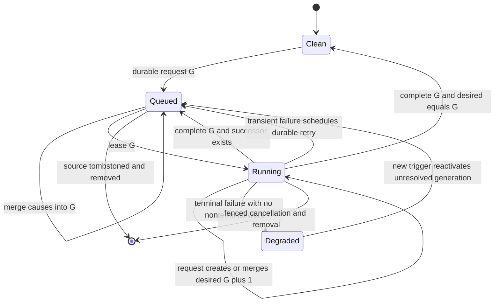
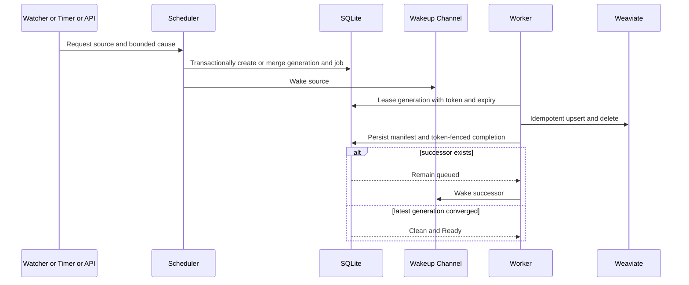

# ADR-002: Durable Reconciliation State and Watcher Recovery

Status: Accepted
Date: 2026-07-22
Related Features: [FEATURE-02](../04-FEATURE/FEATURE-02-RECONCILIATION-AND-WATCHER-RECOVERY.md)
Related Plan: [PLAN-02](../03-PLAN/PLAN-02-PHASE2-RETRIEVAL-QUALITY-OPERATIONAL-HARDENING.md)
Related Design: [DESIGN.md Sections 5.5, 10, 11, 13, 16, and 19](../01-DESIGN/DESIGN.md)
Supersedes: none
Superseded by: none
Decision review: Accepted by the configured `solution-architect` agent on 2026-07-22 after correction of generation-state transitions, retry/status semantics, SQL invariants and migration ordering, bounded retention, and full-window lease/removal fencing. Accepted review SHA-256: `2BFA9A7BD4FAC0C5075AAE1EFE071FBAE7A634F21BB595568BC6D5F4A0DD2197`.

---

## Implementation plan (step-by-step)

- [x] Add the reconciliation domain records, cause flags, status projection, and application interfaces.
- [x] Add the additive SQLite reconciliation schema, legacy-job migration, transactional state store, indexes, and constraints.
- [x] Add one scheduler for watcher, startup, periodic, manual, and retry requests, with durable due-work dispatch.
- [x] Add generation-bearing, token-fenced, expiring job leases and stale-completion rejection.
- [x] Add per-source operation fencing so removal cannot race with recovery or resurrect vectors.
- [x] Return scan outcome counts and clear dirty/degraded state only after complete convergence.
- [x] Add additive REST, MCP, VS Code status, bounded metrics, safe logs, and validated configuration.
- [x] Add and run the mapped positive, negative, edge, restart, race, live Weaviate, and live ONNX tests.
- [x] Update DESIGN.md, PLAN-02, FEATURE-02, operations documentation, and this ADR with verified evidence.

---

## Context

`FileSystemWatcher` is already treated as a hint, and the host has periodic/startup scans, durable index jobs, deterministic chunk identities, content hashes, retries, and checkpoints. The current paths do not yet form one recovery protocol:

- watcher errors write `Degraded` asynchronously and then enqueue an ordinary job through an in-memory debounce;
- startup, periodic, and manual reindex paths bypass the watcher path;
- ordinary hints received during an active job are dropped, so a final filesystem state can be missed;
- job rows do not persist recovery cause, generation, outcome counts, or a durable dirty/running state;
- startup resets processing jobs but does not durably dispatch due work as the source of truth;
- a completed scan writes `Ready` without proving that no later hint is pending; and
- source removal is not fenced against an in-flight scan that can write vectors after deletion.

SQLite remains operational truth and Weaviate remains the searchable vector store. The host remains single-node and local-first. Watcher events are untrusted, lossy hints; the current eligible filesystem snapshot and SQLite manifest determine convergence.

Goals:

- persist every recovery obligation before relying on an in-memory wakeup;
- coalesce bursts into at most one active and one follow-up generation per source;
- survive restart, retry transient failures durably, and reject stale worker completion;
- clear dirty/degraded state only after the latest requested generation fully converges;
- avoid passage embedding and vector upsert for manifest-committed unchanged content;
- expose bounded, privacy-safe recovery status and metrics; and
- prevent source removal from racing with or being undone by recovery.

Non-goals:

- a distributed filesystem event log, distributed scheduler, or multiple active hosts sharing one SQLite database;
- remote/network filesystem guarantees beyond documented platform behavior;
- atomic transactions spanning SQLite and Weaviate;
- destructive vector-store repair outside the registered source boundary; or
- changing the embedding profile, chunk-profile transition contract, or Weaviate lifecycle ownership.

---

## Stakeholders (who needs this to be clear)

| Role | What they need to know | Questions this ADR answers |
| --- | --- | --- |
| Product / Owner | Automatic recovery and observable degraded/recovering states | When does recovery start, finish, and remain degraded? |
| Engineering | State, generations, leases, concurrency, and adapter boundaries | How are hints coalesced without being lost? |
| DevOps / SRE | Restart, retry, metrics, migration, and rollback | Which state is durable and how is it repaired safely? |
| QA | Deterministic failure, overflow, race, and convergence evidence | Which tests prove every invariant and feature scenario? |

---

## Decision

Introduce one durable, generation-aware reconciliation scheduler backed by SQLite. Every watcher, startup, periodic, manual, retry, and initial-registration trigger records a bounded cause and desired generation transactionally before the in-memory channel is signaled. SQLite state and due-work queries are authoritative; the channel is only a latency optimization.

### State model and invariants

One `SourceReconciliations` row exists for every registered source:

```sql
CREATE TABLE SourceReconciliations (
  SourceId TEXT PRIMARY KEY REFERENCES Sources(SourceId) ON DELETE CASCADE,
  DesiredGeneration INTEGER NOT NULL DEFAULT 0 CHECK (DesiredGeneration >= 0),
  CompletedGeneration INTEGER NOT NULL DEFAULT 0 CHECK (CompletedGeneration >= 0),
  ActiveGeneration INTEGER NULL CHECK (ActiveGeneration IS NULL OR ActiveGeneration > 0),
  State TEXT NOT NULL CHECK (State IN ('Clean', 'Queued', 'Running', 'Degraded')),
  PendingCauseMask INTEGER NOT NULL DEFAULT 0 CHECK (PendingCauseMask >= 0),
  ActiveCauseMask INTEGER NOT NULL DEFAULT 0 CHECK (ActiveCauseMask >= 0),
  RequestedUtc TEXT NULL,
  StartedUtc TEXT NULL,
  LastSucceededUtc TEXT NULL,
  LastFailedUtc TEXT NULL,
  LastOutcome TEXT NULL,
  LastErrorCode TEXT NULL,
  LastErrorSummary TEXT NULL,
  LastChangedFiles INTEGER NOT NULL DEFAULT 0,
  LastDeletedFiles INTEGER NOT NULL DEFAULT 0,
  LastUnchangedFiles INTEGER NOT NULL DEFAULT 0,
  CHECK (CompletedGeneration <= DesiredGeneration),
  CHECK (ActiveGeneration IS NULL OR ActiveGeneration <= DesiredGeneration),
  CHECK (
    (State = 'Running' AND ActiveGeneration IS NOT NULL
      AND CompletedGeneration < ActiveGeneration AND ActiveCauseMask > 0)
    OR
    (State <> 'Running' AND ActiveGeneration IS NULL AND ActiveCauseMask = 0)
  ),
  CHECK (
    State <> 'Clean'
    OR (DesiredGeneration = CompletedGeneration
      AND ActiveGeneration IS NULL
      AND PendingCauseMask = 0
      AND ActiveCauseMask = 0)
  )
);
```

`Dirty` is the durable predicate `DesiredGeneration > CompletedGeneration`. `State` describes scheduling/execution; it does not replace the generation invariant. Cause flags are a closed set: `Initial`, `FileHint`, `WatcherOverflow`, `WatcherError`, `Startup`, `Periodic`, `Manual`, and `Retry`.

`IndexJobs` retains its existing profile-transition and retry payload and gains:

```sql
JobKind TEXT NOT NULL DEFAULT 'Reconciliation'
Generation INTEGER NOT NULL DEFAULT 0
CauseMask INTEGER NOT NULL DEFAULT 0
LeaseId TEXT NULL
LeaseExpiresUtc TEXT NULL
```

After legacy normalization, the migration creates the exact partial indexes below. Together they permit one active generation and one follow-up while preventing duplicate work for the same generation:

```sql
CREATE UNIQUE INDEX UX_IndexJobs_Reconciliation_Processing
  ON IndexJobs(SourceId)
  WHERE JobKind = 'Reconciliation' AND Status = 'Processing';
CREATE UNIQUE INDEX UX_IndexJobs_Reconciliation_Pending
  ON IndexJobs(SourceId)
  WHERE JobKind = 'Reconciliation' AND Status = 'Pending';
CREATE UNIQUE INDEX UX_IndexJobs_Reconciliation_Generation
  ON IndexJobs(SourceId, Generation)
  WHERE JobKind = 'Reconciliation' AND Status IN ('Pending', 'Processing');
```

Existing chunk-profile target fingerprint and force flags are merged using the strongest requested semantics and are never discarded by recovery coalescing.

`Sources` gains `LifecycleState TEXT NOT NULL DEFAULT 'Active'` and `LifecycleEpoch INTEGER NOT NULL DEFAULT 0`. Allowed lifecycle values are `Active` and `Removing`; every request, lease, vector-mutation fence, and completion predicate requires the expected active epoch.

### Transactional request and coalescing

Requesting reconciliation runs under `BEGIN IMMEDIATE` in one SQLite transaction that updates `SourceReconciliations` and creates or merges the corresponding `IndexJobs` row. Conditional lease/completion updates must affect exactly one row or be treated as stale/conflicting work:

| Current state | Request result |
| --- | --- |
| Clean (`Desired = Completed`) | Increment desired to generation G, set Queued, store causes, insert G. |
| Queued G | OR causes into G and update requested time; do not create another generation. |
| Running G with no successor | Set desired to G+1, create one Pending successor, store causes. |
| Running G with successor G+1 | OR causes into G+1; do not create another generation. |
| Degraded unresolved G | Requeue the unresolved desired generation when no nonterminal job exists; otherwise merge causes. |

At most one active and one follow-up generation exist for a source. A successful generation G sets `CompletedGeneration = G`. If `DesiredGeneration > G`, state remains Queued and the successor is woken. Only when `DesiredGeneration = CompletedGeneration` may state become Clean and the compatibility source status return to Ready.

### Leasing, restart, and durable dispatch

- A worker acquires the process-local per-source operation gate before leasing. It holds that gate for the full filesystem traversal, embedding, Weaviate mutation, SQLite manifest, and token-fenced completion window. A same-process replacement cannot lease while the expired lease owner still holds the gate.
- Leasing is transactional and assigns a random `LeaseId` plus an expiry. Defaults are a validated 120-second lease and 30-second renewal interval.
- A worker renews its lease while scanning. Completion, failure, cancellation, and checkpoint updates require the current source, generation, and lease token. A stale worker cannot commit recovery state or source status.
- The dispatcher queries pending jobs whose `NextAttemptUtc` is due and processing jobs whose leases expired. It sleeps only until the next durable due time; `IndexWorkChannel` is a wakeup hint. It may signal an expired source, but a replacement cannot lease in the same process until the operation gate is released.
- Startup resets expired legacy/in-flight work to Pending, restores Queued/Degraded reconciliation rows, and signals every due source returned by the durable query.
- Graceful shutdown releases active leases to Pending without consuming a retry attempt. Abrupt shutdown is recovered after lease expiry.
- The supported topology remains one active host per SQLite database. Lease fencing bounds stale or accidental duplicate work but is not a distributed coordination claim.

### Execution and convergence

Each generation performs an at-least-once full-source reconciliation against the current eligible filesystem snapshot and SQLite manifest:

- metadata-identical files skip reading;
- content-hash-identical files perform zero passage embeddings and zero vector upserts;
- changed/new chunks use deterministic IDs and existing idempotent vector upsert semantics;
- stale chunks are removed from Weaviate and SQLite;
- successful outcome counts include changed, deleted, and unchanged files; and
- a generation succeeds only after traversal, changed upserts, stale deletions, manifest persistence, and any chunk-profile transition complete.

SQLite and Weaviate cannot commit atomically. If the process stops after a vector upsert but before SQLite persistence, the same changed content may be embedded again after restart. Deterministic vector IDs guarantee convergence without duplicates. The zero-reembedding guarantee applies to content already committed in the SQLite manifest.

### Failure, retry, and status projection

Failures are classified into bounded codes: `DependencyUnavailable`, `FileUnstable`, `SourceMissing`, `SchemaMismatch`, `StateCorrupt`, `Cancelled`, and `Unexpected`. Persisted/API summaries are fixed safe text; raw exception messages, stack traces, content, absolute paths, and lease tokens are never persisted or returned.

- cancellation caused by graceful shutdown requeues without consuming an attempt;
- transient dependency/file-instability failures clear the active lease, retain the same generation as Pending with `NextAttemptUtc`, set reconciliation state Queued, and project a safe degraded compatibility status while durable exponential backoff runs;
- terminal exhaustion preserves `DesiredGeneration > CompletedGeneration`, retains the failed job/dead-letter evidence, and leaves recovery Degraded until a later trigger or dependency-health recovery requeues the unresolved generation;
- schema mismatch or corrupt state fails readiness and stops writes;
- a missing root never completes a generation and never deletes indexed data before the existing grace policy allows cleanup.

`SourceStatus` is a compatibility projection, not recovery truth:

- Paused is never overwritten by scheduler activity. Requests may remain durably dirty/Queued while paused, but the lease predicate excludes paused sources and resume explicitly wakes their due work;
- missing-root degradation and chunk-profile failure remain distinct and are not cleared by an unrelated recovery completion;
- a leased generation retains compatibility `SourceStatus.Indexing`; the additive authenticated `recovery.state=Running` is rendered as “Recovering” by REST/MCP/VS Code clients. This avoids persisting a new enum value that an operational rollback could not parse;
- watcher failure or exhausted retry projects Degraded; and
- Ready is projected only after the latest desired generation is complete, the root is present, and any chunk-profile transition is Ready.

The authenticated REST/MCP source status adds a recovery object containing state, desired/completed/active generation, bounded causes, timestamps, last safe outcome/error code, and result counts. It never exposes roots, relative paths, lease data, or unbounded labels.

### Removal fencing

Source removal first durably tombstones the source lifecycle, prevents new requests, cancels pending work, and signals active work to stop. It then acquires the same per-source operation gate used by reconciliation/profile work, revalidates the tombstone, untracks the watcher, deletes vectors, and cascades SQLite source/recovery/job state. Workers revalidate the lifecycle epoch/tombstone before vector mutation and completion. Startup resumes an interrupted tombstone. This prevents removed sources or chunks from being resurrected.

### Observability and retention

Logs use source ID, generation, bounded causes/outcome, attempt, duration, and counts. A relative-path hash may be used only when essential. Metrics have bounded dimensions and no source/path/content labels: request/overflow/run/outcome/retry/lease-recovery totals, duration, changed/deleted/unchanged counts, and dirty/degraded gauges.

Completed reconciliation-job detail retains the latest 20 terminal generations per source by default, configurable from 1 through 100. Older succeeded/cancelled rows are deleted only after a later successful checkpoint. The newest unresolved terminal failure and its safe dead-letter evidence are retained regardless of the count limit until a later generation succeeds. Source removal deletes all scoped rows. Legacy dead letters have no existing automatic retention policy and are not silently pruned by this feature migration.

---

## Diagram





---

## Alternatives considered

### Watcher-only or manual recovery

- Pros: smallest implementation.
- Cons: missed/overflowed events remain correctness failures and restart recovery depends on operator action.
- Rejected because: it violates FEATURE-02 automatic convergence.

### In-memory debounce/channel as operational truth

- Pros: low SQLite write volume and simple runtime code.
- Cons: loses work on restart and cannot prove that a hint during generation G creates G+1.
- Rejected because: dirty state and recovery obligation must be durable.

### One durable job per filesystem event

- Pros: preserves event history.
- Cons: save bursts create storms, event ordering is not a trustworthy manifest, and the design needs snapshot convergence rather than event replay.
- Rejected because: bounded generation coalescing is sufficient and safer.

### One durable dirty boolean

- Pros: compact state.
- Cons: cannot distinguish work covered by the running scan from a later hint or reject stale completion.
- Rejected because: generation watermarks are required for no-lost-hint evidence.

### Parallel scans for one source

- Pros: apparent throughput.
- Cons: conflicting manifests, deletes/upserts, retries, and status writes.
- Rejected because: one active generation per source is the correctness boundary.

### Distributed event journal and scheduler

- Pros: multi-host coordination and full event audit.
- Cons: substantial infrastructure and product-scope expansion.
- Rejected because: current scope is a single local host converging from snapshots.

---

## Consequences

### Positive

- Overflow, missed events, restarts, and repeated hints converge automatically without unbounded job storms.
- Dirty state and latest-generation completion are provable from SQLite.
- Stale workers cannot clear newer work or resurrect a removed source.
- Existing hash/deterministic-ID behavior prevents unchanged re-embedding and duplicate vectors.
- REST, MCP, VS Code, logs, and metrics share one bounded recovery model.

### Negative / risks

- Scheduler transactions serialize per SQLite writer during extreme save bursts.
  - Mitigation: short transactions, cause masks, one row/source, bounded channel, and load tests.
- Lease expiry during a long stall can briefly duplicate execution.
  - Mitigation: renewal and token-fenced completion/mutation checks.
- SQLite/Weaviate non-atomicity can repeat changed-file embedding after a crash.
  - Mitigation: deterministic IDs, idempotent operations, explicit at-least-once semantics, and fault tests.
- Large scans can delay other sources.
  - Mitigation: validated global reconciliation concurrency distinct from per-file concurrency and fair due-work dispatch.
- A prior binary cannot maintain generation watermarks during rollback.
  - Mitigation: drain/quiesce precondition and forward-upgrade reconciliation.

---

## Impact

### Code

- New domain/application boundaries: reconciliation cause/status/state/request/lease/result records, state store, scheduler, and source operation gate.
- Changed services: `SourceWatcherRegistry`, `ReconciliationService`, `StartupInitializationService`, `IndexCoordinator`, `IndexJobStore`, `IndexWorker`, API/MCP mapping, metrics, configuration, and VS Code source status.
- The scheduler depends on SQLite state/jobs and the wakeup channel, not `IndexCoordinator`, avoiding a dependency cycle.

### Data / configuration

- Add `SourceReconciliations`, generation/lease/cause columns and indexes on `IndexJobs`, source lifecycle/tombstone state, and richer checkpoints.
- Use a versioned transactional migrator rather than duplicate-column exception handling for this feature. Configure a bounded SQLite busy timeout and bounded replay of `SQLITE_BUSY`/`SQLITE_BUSY_SNAPSHOT`; never spin indefinitely.
- Add validated lease duration, renewal interval, reconciliation concurrency, and terminal-history retention settings (default 20, range 1-100); no secrets.
- Existing schemas are migrated additively and idempotently. Existing clients ignore additive response fields.

### Documentation

- Update FEATURE-02 and PLAN-02 evidence/status, DESIGN.md recovery/data flow, README configuration/operations, and API/MCP/VS Code recovery status guidance.
- No new repository instruction is required in `AGENTS.md`.

---

## Verification

### Objectives

- Prove transactional coalescing, one active/one successor, token fencing, durable due-time dispatch, restart recovery, retry retention, removal fencing, and safe status projection.
- Prove full create/change/delete convergence and zero embedding/upsert for a manifest-committed unchanged source.
- Prove bounded, redacted metrics/status and preserve chunk-profile forced-successor behavior.

### Test environment

- Unit/integration: temporary source roots and SQLite databases, deterministic watcher/error and clock seams, controllable dependencies, and fault injection around vector/manifest commits.
- Live: real BGE ONNX assets and an isolated collection on externally managed Weaviate.
- Reset: unique temporary roots/databases/collections per test; never mutate registered user sources or manage Weaviate lifecycle.

### Test commands

- build: `dotnet build .\LocalRag.sln -c Release`
- test: `dotnet test .\LocalRag.sln -c Release`
- format: `dotnet format .\LocalRag.sln --verify-no-changes`
- live: set `LOCALRAG_ONNX_TESTS=1` and `WEAVIATE_TEST_ENDPOINT=http://127.0.0.1:8080`, then run `dotnet test .\LocalRag.sln -c Release`
- coverage: run the repository's deterministic coverage command added for FEATURE-02 and retain its machine-readable report.

### New or changed tests

| ID | Scenario | Level | Expected result |
| --- | --- | --- | --- |
| POS-02-001 | Watcher overflow plus create/change/delete | Integration/live | One bounded recovery converges SQLite/Weaviate and returns Clean/Ready. |
| POS-02-002 | Restart with queued/running work | Integration | Due work resumes; stale lease cannot complete. |
| POS-02-003 | Reconcile unchanged committed source | Integration/live | Zero passage embeddings and vector upserts. |
| NEG-02-001 | Weaviate/model unavailable through max attempts | Integration | Durable backoff, retained/dead-letter job, dirty Degraded state, safe error. |
| NEG-02-002 | Source removed during recovery | Integration | Fenced cancellation/cleanup; no source/vector resurrection. |
| EDGE-02-001 | Repeated overflow during active G | Concurrency | Exactly one G+1 successor; all later causes merge. |
| EDGE-02-002 | Crash after vector upsert before manifest commit | Fault integration/live | Retry converges with deterministic IDs and no duplicates. |
| EDGE-02-003 | Temporarily missing root | Integration | Grace policy preserves source, recovery state, and indexed data; later recovery resumes. |
| ADR-02-001 | Lease expiry and stale completion | Unit/integration | New lease proceeds; old token cannot mutate completion/status. |
| ADR-02-002 | Status/log/metrics redaction | Contract | No content, absolute path, raw exception, lease ID, or source-labelled metric. |
| ADR-02-003 | Legacy forced profile job migration | Migration | Strongest target/force request survives and remains sequential. |

### Regression and analysis

- Run full host tests, structural/profile transition tests, watcher/document tests, REST/MCP contracts, extension lint/tests, and live integration suite.
- Run Release build and `dotnet format --verify-no-changes` after the final source/evidence edit.
- Inspect metrics/status/log output for bounded cardinality and redaction.

---

## Rollout and migration

Migration is additive, idempotent, and schema-versioned:

1. Add nullable/defaulted job columns, lifecycle fields, and the reconciliation table without conflicting unique indexes.
2. In one `BEGIN IMMEDIATE` migration transaction, reset legacy Processing rows; merge redundant nonterminal jobs into at most a current plus successor generation; assign positive generations; backfill every other source as Clean 0/0; preserve the latest non-null chunk-profile target and strongest force flag; and mark redundant rows Superseded.
3. Validate every state/generation invariant, then create the partial unique indexes and commit. Do not create generation uniqueness before legacy generation-zero rows are normalized.
4. Queue startup reconciliation through the scheduler and dispatch every due durable source.
5. After a later successful checkpoint, prune succeeded/cancelled reconciliation history beyond the validated 1-100 per-source limit while retaining the newest unresolved failure evidence.

Rollback is non-destructive: stop new requests, drain or release leases, verify no removal tombstones or running leases remain, deploy the prior binary, and retain the new tables/columns. Do not drop recovery data. A later forward upgrade schedules reconciliation for every source because an older binary cannot maintain generation watermarks.

---

## References

- [DESIGN.md](../01-DESIGN/DESIGN.md)
- [PLAN-02](../03-PLAN/PLAN-02-PHASE2-RETRIEVAL-QUALITY-OPERATIONAL-HARDENING.md)
- [FEATURE-02](../04-FEATURE/FEATURE-02-RECONCILIATION-AND-WATCHER-RECOVERY.md)
- [ADR-001](ADR-001-language-aware-structural-chunking.md)
- `src/LocalRag.Host/Infrastructure/Indexing/SourceWatcherRegistry.cs`
- `src/LocalRag.Host/Infrastructure/Indexing/ReconciliationService.cs`
- `src/LocalRag.Host/Infrastructure/Indexing/IndexJobStore.cs`
- `src/LocalRag.Host/Infrastructure/Indexing/IndexWorker.cs`
- `src/LocalRag.Host/Infrastructure/Indexing/IndexCoordinator.cs`
- `src/LocalRag.Host/Infrastructure/Sqlite/SqliteIndexStateStore.cs`

---

## Filing checklist

- [x] File saved under `.swe/02-ADR/ADR-###-TITLE.md`.
- [x] Status reflects current review state (`Accepted`).
- [x] Links to related design, plan, feature, tests, and ADRs are filled in.
- [x] Diagram section contains Mermaid state and sequence diagrams.
- [x] Independent architecture review accepts the exact decision.
- [x] `.swe/01-DESIGN/DESIGN.md` is updated after implementation confirms the boundaries.

## Implementation evidence (2026-07-22)

- The durable generation store, token-fenced leases, lifecycle tombstones, unified scheduler/dispatcher, retry signaling, bounded SQLite contention replay, status/metrics/API/MCP/VS Code surfaces, and operations documentation implement this decision without changing the external Weaviate ownership boundary.
- Automated evidence covers generation ordering/coalescing, restart and lease recovery, source-removal fencing, forced-profile migration/successors, dependency and locked-file retries, resolved/unresolved retention, vector/manifest crash convergence, missing roots, burst/load behavior, unchanged no-reembedding, and diagnostic redaction.
- Release evidence passed: 124 local tests with only four explicitly gated skips; 3/3 explicit real ONNX/Weaviate/live-recovery tests; Release build with zero warnings/errors; formatting, Cobertura collection, TypeScript lint, and 9/9 extension tests.
- Final independent architecture and C# implementation/test-evidence judgments both returned `APPROVE`; detailed completion evidence is recorded in FEATURE-02.
