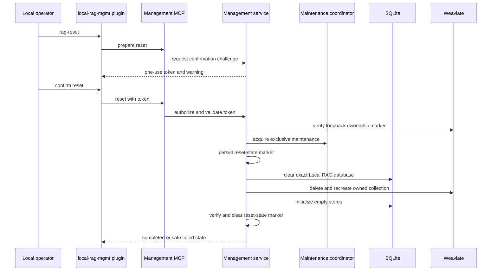

# ADR-003: Local Management and Destructive Reset

Status: Accepted
Implementation status: Implemented and independently reviewed on 2026-07-23
Date: 2026-07-23
Related Features: [FEATURE-09](../04-FEATURE/FEATURE-09-LOCAL-RAG-MANAGEMENT-PLUGIN.md)
Related Plan: [PLAN-02](../03-PLAN/PLAN-02-PHASE2-RETRIEVAL-QUALITY-OPERATIONAL-HARDENING.md)
Related Design: [DESIGN.md Sections 3.4, 4.1, 5.2-5.3, 7, 9-11, 13, and 19](../01-DESIGN/DESIGN.md)
Supersedes: none
Superseded by: none
Decision authorization: Accepted as an explicit user-authorized `FEATURE-09 -Force` scope exception on 2026-07-23.

---

## Implementation plan (step-by-step)

- [x] Add the disabled-by-default management configuration, distinct authentication scheme, and route-specific MCP tool filtering.
- [x] Add application management contracts for index-by-path, remove-by-path, confirmation challenges, and reset.
- [x] Add shared maintenance fencing, durable reset-state evidence, SQLite reset, and owned Weaviate collection reset.
- [x] Add the `local-rag-mgmt` plugin and its three explicitly invoked skills.
- [x] Add positive, negative, edge, authorization, crash/failure, compatibility, and redaction tests.
- [x] Run build, tests, format, coverage, plugin/skill validation, and independent review.
- [x] Synchronize this ADR, FEATURE-09, PLAN-02, DESIGN.md, and operator documentation with evidence.

---

## Context

LocalRag.Host already exposes authenticated source registration, source-ID removal, reindexing, search, chunk retrieval, health, metrics, and a read-only MCP endpoint. Registration canonicalizes roots in `SqliteSourceRegistry`; removal is correctly fenced through `IndexCoordinator.RemoveSourceAsync`; SQLite is operational truth; and `WeaviateVectorStore` owns the configured Local RAG collection. The existing `local-rag-skills` plugin intentionally exposes only retrieval tools.

FEATURE-09 adds a separate Codex plugin that must index a local folder by path, remove the index for an exact registered folder path, and perform an irreversible fresh reset of all Local RAG SQLite state and all objects/schema in the configured Local RAG Weaviate collection.

Administrative mutation must not appear on the standard `/mcp` tool list, use the ordinary retrieval token, delete source files, delete arbitrary Weaviate collections, or silently continue after a partial reset. The host is single-node and loopback-only. SQLite and Weaviate cannot participate in one atomic transaction, so reset needs explicit maintenance and recovery semantics.

Goals:

- preserve the existing read-only MCP compatibility boundary;
- make every management mutation pass through shared application services;
- require a distinct credential and explicit opt-in;
- bind destructive confirmation to one action and target;
- prevent active or stale workers from recreating state during reset;
- prove that the Weaviate collection belongs to this Local RAG installation before deleting it; and
- fail closed and remain not-ready after partial reset until an explicit recovery/reset succeeds.

Non-goals:

- deleting or modifying source files;
- managing the Weaviate process, Docker, volumes, or unrelated collections;
- remote/shared-host administration, OIDC, multi-user roles, backups, or undo;
- automatically retrying an operator's destructive reset; or
- changing normal retrieval, ranking, embedding, or indexing semantics.

---

## Stakeholders (who needs this to be clear)

| Role | What they need to know | Questions this ADR answers |
| --- | --- | --- |
| Product / Owner | Exact behavior and irreversible blast radius | What is erased, preserved, and confirmed? |
| Engineering | Adapter, service, fencing, persistence, and failure boundaries | Which component owns each safety invariant? |
| DevOps / SRE | Enablement, secrets, readiness, recovery, and rollback | How does a partial reset fail and recover? |
| QA | Executable authorization, concurrency, and destructive-boundary scenarios | What evidence proves reset cannot escape scope? |

---

## Decision

Add a separately authenticated, disabled-by-default local management surface and Codex plugin. Management MCP tools are filtered per HTTP route, call one application management service, and use an exclusive maintenance protocol for reset. Reset deletes and recreates only the exact Local RAG SQLite database and the ownership-verified configured Weaviate collection.

### Adapter and authentication boundary

- Keep the existing `/mcp` endpoint and `RagMcpTools` read-only.
- Add `/management/mcp` and management REST contract equivalents under `/api/v1/management`.
- Register both tool types with the MCP server but use `HttpServerTransportOptions.ConfigureSessionOptions` to assign a per-request `ToolCollection`: standard routes receive only retrieval tools; `/management/mcp` receives only `rag_index`, `rag_remove_index`, and `rag_reset`.
- Map `/management/mcp` and management REST routes to a dedicated `ManagementToken` authentication scheme. The existing local token cannot satisfy that policy.
- Add `LocalRag:Management:Enabled` (default `false`), `Token` (required only when enabled), and bounded confirmation lifetime. Reject enabled configuration when the management token is missing or equals the standard token.

### Confirmation protocol

`rag_index` is not destructive and executes in one call. `rag_remove_index` and `rag_reset` use the same tool in two phases:

1. A call without `confirmationToken` validates the request and returns `ConfirmationRequired`, a cryptographically random one-use token, an expiry, and a fixed warning.
2. A second call supplies the token. The host verifies constant-time token equality, action type, canonical-target hash, expiry, one-use state, and current management principal before mutation.

Confirmation state is memory-only, bounded, and invalid after host restart. Tokens are never logged or persisted. Remove confirmations are bound to the canonical root hash. Reset confirmations are bound to the current installation ownership ID and configured collection.

### Ownership and reset scope

- A stable random installation ownership ID is stored outside SQLite under the configured Local RAG data directory with user-only file permissions where supported.
- When Local RAG creates its Weaviate collection, the collection schema description contains a versioned Local RAG ownership marker derived from that ID.
- Reset requires a loopback HTTP(S) Weaviate endpoint, the configured collection name, and an exact marker match read back from Weaviate.
- Reset deletes only the configured collection through a dedicated `IManagementVectorStore` operation and immediately recreates/validates its normal schema.
- Reset deletes only `localrag.db`, `localrag.db-wal`, and `localrag.db-shm` beneath the resolved configured data directory. It preserves source folders, embedding/model assets, ownership evidence, configuration, logs, and unrelated files/collections.

### Maintenance and recovery protocol

- `HostMaintenanceCoordinator` provides shared operational leases and one exclusive maintenance lease.
- Registration, reindex, removal, scheduler requests, reconciliation dispatch/processing, and other index mutations require an operational lease. Reset sets maintenance first, rejects new leases, cancels active mutation tokens, and waits for active leases to drain.
- The maintenance generation is checked before worker completion. Existing ADR-002 source lifecycle/lease fencing remains authoritative inside a source; the global maintenance fence adds a host-wide boundary.
- Before the first destructive step, reset atomically writes a small `reset-state.json` marker outside SQLite containing version, ownership ID, operation ID, state, and safe phase code. It contains no token, path, content, or raw error.
- Startup and readiness fail closed while the marker is nonterminal. The host does not automatically resume the destructive request. A later explicitly confirmed `rag_reset` may idempotently repeat cleanup and complete recovery.
- Successful reset reinitializes all SQLite stores and the owned Weaviate schema, verifies zero sources/chunks/jobs and dependency readiness, marks the reset complete, removes the marker, then releases maintenance.
- Failure after maintenance begins returns a bounded safe failure, keeps readiness unhealthy and management recovery available, and retains the marker.

### Results and observability

- Management results contain operation ID, state, safe error code, timestamps, source ID when applicable, and bounded counts. Canonical roots, tokens, collection credentials, source content, and raw dependency errors are excluded.
- Logs and metrics use bounded operation/outcome labels. Confirmation tokens and folder paths are never logged.
- Plugin skills invoke only `mcp__local_rag_mgmt__*` tools. They never access SQLite, Weaviate, source files, or the standard retrieval token directly.

---

## Diagram

---

## Alternatives considered

### Add administrative tools to the existing `/mcp`

- Pros: smallest endpoint change.
- Cons: changes the standard tool inventory, broadens the retrieval token, and makes accidental mutation more likely.
- Rejected because: read-only compatibility and credential separation are feature invariants.

### Let the plugin access SQLite and Weaviate directly

- Pros: avoids host API changes.
- Cons: bypasses source lifecycle fencing, schema validation, authentication, readiness, and observability.
- Rejected because: MCP/plugins are adapters, not the domain or persistence layer.

### Delete the entire Weaviate instance or Docker volume

- Pros: superficially simple full reset.
- Cons: may destroy unrelated collections and requires process/volume authority outside Local RAG.
- Rejected because: the host owns one verified collection, not the external Weaviate lifecycle.

### Use a typed confirmation phrase without a challenge token

- Pros: simple UI.
- Cons: replayable, weakly bound to the target, and cannot prove freshness.
- Rejected because: destructive confirmation must be action-specific, fresh, and one-use.

### Automatically resume reset after restart

- Pros: fewer operator steps.
- Cons: repeats destructive work without a fresh authorization and can conceal the failure phase.
- Rejected because: a destructive request must never be retried implicitly.

---

## Consequences

### Positive

- The standard MCP surface and token remain read-only and compatible.
- Management mutations reuse existing application, source lifecycle, and reconciliation boundaries.
- Exact target binding, ownership validation, and exclusive maintenance reduce accidental data loss.
- A partial reset is observable and cannot be reported as ready or successful.
- Plugin and host can be tested independently through stable contracts.

### Negative / risks

- Per-route MCP tool filtering depends on the pinned MCP SDK's per-session options contract.
  - Mitigation: pin SDK behavior with tool-list contract tests.
- SQLite and Weaviate reset remain non-atomic.
  - Mitigation: durable external reset phase marker, idempotent explicit retry, and fail-closed readiness.
- A lost ownership file prevents reset of an otherwise valid collection.
  - Mitigation: fail closed and document manual recovery; never guess ownership.
- Host-wide maintenance adds coordination to existing worker and scheduler paths.
  - Mitigation: shared lease abstraction, bounded drain timeout, cancellation/race tests, and no distributed-host claim.
- Successful reset cannot be rolled back without a separate backup.
  - Mitigation: explicit warning and confirmation; backups remain out of scope.

---

## Impact

### Code

- Add management contracts/models, `LocalRagManagementService`, confirmation store, ownership store, reset-state store, and `HostMaintenanceCoordinator`.
- Add `ManagementTokenAuthenticationHandler`, `RagManagementMcpTools`, management REST contracts/routes, and MCP tool visibility filtering.
- Extend scheduler/worker/index mutation entry points and readiness checks with maintenance state.
- Add exact database reset support to `SqliteDatabase` and owned collection reset support through `IManagementVectorStore`.
- Add `plugins/local-rag-mgmt/` with three manually invoked skill bundles.
- Feature flags: `LocalRag:Management:Enabled=false` and reset remains unavailable until enabled with a distinct token.

### Data / configuration

- Add management configuration keys and two small local files under `DataDirectory`: installation ownership evidence and transient reset-state evidence.
- No normal SQLite migration is required solely for management; reset recreates the current schema through existing versioned initializers.
- Existing clients, tokens, standard routes, `/mcp`, and response contracts remain compatible.
- The ownership file is not a secret but must not be writable by other users where platform permissions can enforce that boundary.

### Documentation

- Update FEATURE-09, PLAN-02, DESIGN.md architecture/security/recovery/configuration sections, README management setup, plugin usage, destructive warnings, and recovery guidance.
- Record test and review evidence in this ADR and FEATURE-09.
- No new general repository rule is required in `AGENTS.md`.

---

## Verification

### Objectives

- Prove route-specific tool lists and distinct authentication: standard clients cannot discover or call management tools.
- Prove confirmation freshness, one-use behavior, action/target/principal binding, expiry, and constant-time comparison.
- Prove index/remove delegate to existing application lifecycle paths and never mutate source files.
- Prove ownership, loopback, collection, and exact database-path checks happen before deletion.
- Prove maintenance drains/cancels mutations and stale work cannot recreate SQLite/vector state.
- Prove partial reset retains fail-closed readiness and requires a new explicit reset.

### Test environment

- Unit/API: temporary data/source directories, fake clocks/randomness/principals, fake management vector store, and deterministic worker seams.
- Integration: disposable SQLite database and dedicated isolated Weaviate collection with a test ownership marker.
- Reset tests must never use the operator's normal data directory, source roots, or collection.

### Test commands

- build: `dotnet build .\LocalRag.sln -c Release`
- test: `dotnet test .\LocalRag.sln -c Release`
- format: `dotnet format .\LocalRag.sln --verify-no-changes`
- live: set explicit test-only ONNX/Weaviate environment variables, then run `dotnet test .\LocalRag.sln -c Release`
- plugin: run the system plugin and skill validators against `plugins/local-rag-mgmt`
- coverage: run the repository deterministic coverage command and retain the machine-readable result.

### New or changed tests

| ID | Scenario | Level | Expected result |
| --- | --- | --- | --- |
| ADR-03-001 | Standard and management MCP list tools | Contract | Each endpoint exposes only its authorized tool set. |
| ADR-03-002 | Management token missing, equal, disabled, or standard | Unit/API | Startup validation or request authorization fails without mutation. |
| ADR-03-003 | Confirmation missing, expired, replayed, wrong action/target/principal | Unit | Destructive call is refused; token is one-use. |
| ADR-03-004 | Reset while reconciliation is active | Concurrency | Work is cancelled/drained; stale completion cannot recreate data. |
| ADR-03-005 | Remote/shared/unowned collection | Integration | Delete is never sent. |
| ADR-03-006 | Failure after SQLite clear | Fault integration | Reset reports failure, marker remains, readiness is unhealthy, explicit retry can recover. |
| ADR-03-007 | Successful full reset | Integration/live | SQLite and owned collection are empty/reinitialized; source files and unrelated collection remain. |

### Regression and analysis

- Run all host unit/integration tests, standard MCP contract tests, reconciliation/removal race tests, live Weaviate tests when explicitly enabled, plugin validation, Release build, and formatting.
- Inspect logs/results for token, absolute-path, source-content, raw-error, and unbounded-label leakage.

---

## Rollout and migration

1. Ship management code disabled by default.
2. Generate/store a distinct local management token and ownership ID during explicit management setup.
3. Ensure or validate the ownership marker on the existing configured collection without deleting data.
4. Install/enable `local-rag-mgmt` only for operators who opt in.
5. Observe authorization failures, maintenance duration, reset phase failures, readiness, and dependency health.

Backward compatibility is additive: older clients keep using the standard token and `/mcp`; management routes are absent/denied unless enabled.

Code rollback disables/removes the management surface without changing existing indexed data when no reset is in progress. Do not roll back while a reset marker is nonterminal. A successful reset is irreversible; code rollback cannot restore deleted index data.

---

## References

- [DESIGN.md](../01-DESIGN/DESIGN.md)
- [PLAN-02](../03-PLAN/PLAN-02-PHASE2-RETRIEVAL-QUALITY-OPERATIONAL-HARDENING.md)
- [FEATURE-09](../04-FEATURE/FEATURE-09-LOCAL-RAG-MANAGEMENT-PLUGIN.md)
- [ADR-002](ADR-002-durable-reconciliation-state-and-watcher-recovery.md)
- `src/LocalRag.Host/Program.cs`
- `src/LocalRag.Host/Application/Contracts.cs`
- `src/LocalRag.Host/Infrastructure/Indexing/IndexCoordinator.cs`
- `src/LocalRag.Host/Infrastructure/Sqlite/SqliteDatabase.cs`
- `src/LocalRag.Host/Infrastructure/Weaviate/WeaviateVectorStore.cs`
- `plugins/local-rag-skills/`

---

## Filing checklist

- [x] File saved under `.swe/02-ADR/ADR-###-TITLE.md`.
- [x] Status reflects the forced accepted decision (`Accepted`).
- [x] Links to the related feature, plan, design, tests, and ADR are filled in.
- [x] Diagram section contains a Mermaid sequence diagram.
- [x] Independent architecture review accepts the implemented decision and evidence.
- [x] `.swe/01-DESIGN/DESIGN.md` is updated after implementation confirms the boundaries.

Implementation evidence is recorded in [FEATURE-09](../04-FEATURE/FEATURE-09-LOCAL-RAG-MANAGEMENT-PLUGIN.md#implementation-evidence). The accepted implementation preserves fail-closed behavior for pre-FEATURE-09 collections that do not carry an ownership marker; automatic marker adoption is intentionally excluded.
