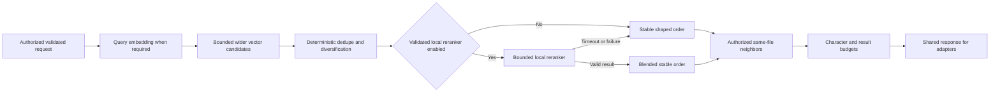

# ADR-004: Contextual Retrieval Ranking and Reranking

Status: Proposed
Date: 2026-07-23
Related Features: [FEATURE-03: Contextual Retrieval Pipeline](../04-FEATURE/FEATURE-03-CONTEXTUAL-RETRIEVAL-PIPELINE.md)
Related Plan: [PLAN-02: Phase 2 Retrieval Quality and Operational Hardening](../03-PLAN/PLAN-02-PHASE2-RETRIEVAL-QUALITY-OPERATIONAL-HARDENING.md)

---

## Implementation plan (step-by-step)

- [x] Analyze the current shared search, vector-store, SQLite chunk-state, REST, and MCP boundaries.
- [x] Define candidate widening, deterministic shaping, optional local reranking, neighbor expansion, budgets, diagnostics, fallback, and compatibility rules.
- [ ] Obtain explicit solution-architecture acceptance of this ADR.
- [ ] Resolve PLAN-02's rejected FEATURE-04 authorization dependency before FEATURE-03 implementation or client exposure.
- [ ] Implement the change in bounded application, infrastructure, and adapter increments.
- [ ] Add automated happy-path, negative, edge, cancellation, relevance, and performance tests.
- [ ] Run build, test, format, coverage, live Weaviate/ONNX evaluation, and record exact results.
- [ ] Update FEATURE-03, PLAN-02, configuration, architecture, and retrieval-evaluation documentation.

---

## Context

The current `RagSearchService` validates a query, resolves visible source IDs, embeds the query, and delegates one hybrid request to `IVectorStore`. `WeaviateVectorStore` returns at most the requested result limit. The application does not yet separate candidate retrieval from final result shaping, diversify repetitive hits, expand same-file context, or expose a bounded reranker policy.

FEATURE-03 requires a shared contextual retrieval pipeline with:

- a wider initial candidate set;
- deterministic score shaping, deduplication, and diversification;
- bounded same-file ordinal neighbors;
- an optional approved local reranker that is disabled by default;
- stable fallback when reranking is disabled, unavailable, cancelled, or times out;
- additive REST and MCP contracts with safe diagnostics and output budgets.

The design requires validation and authorization before vector work, one application implementation for all adapters, search p95 below 300 ms excluding cold model load, and MCP overhead below 25 ms. PLAN-02 also requires FEATURE-04 authorization before exposing a new source-scoped surface. FEATURE-04 is currently marked `Rejected` and not started. This ADR therefore defines the retrieval decision but does not waive that dependency or authorize FEATURE-03 implementation/exposure.

### Goals

- Improve useful-context relevance without making adapter-specific ranking decisions.
- Keep baseline results deterministic and explainable.
- Bound vector candidates, per-file concentration, neighbor expansion, characters, latency, and diagnostics.
- Keep all query and candidate content local.
- Preserve current search behavior when contextual options are omitted.
- Make reranker failure a safe, observable fallback rather than a search outage.

### Non-goals

- Client identity, source grants, credential storage, or authorization migration.
- Compiler-grade dependency/relationship retrieval, parent-child indexing, or Git-aware ranking.
- Remote reranking, answer synthesis, query logging, or arbitrary Weaviate passthrough.
- Enabling supplied-vector search or new administrative capabilities.
- Selecting or silently downloading a production reranker model artifact.

---

## Stakeholders (who needs this to be clear)

| Role | What they need to know | Questions this ADR answers |
| --- | --- | --- |
| Product / Owner | Quality, latency, and compatibility behavior | What improves, and what remains unchanged by default? |
| Engineering | Pipeline boundaries, algorithms, contracts, and failure semantics | Where do candidate retrieval, shaping, reranking, and neighbors live? |
| DevOps / SRE | Configuration, model provenance, budgets, and safe diagnostics | How is the feature enabled, observed, and disabled safely? |
| QA | Deterministic outcomes and live evaluation gates | Which positive, forbidden, edge, latency, and relevance cases must pass? |

---

## Decision

Implement one application-owned contextual retrieval pipeline that retrieves a bounded wider candidate set, applies deterministic shaping, optionally invokes an explicitly configured local reranker, expands authorized same-file neighbors, and enforces output budgets before adapters serialize results.

This decision is accepted only together with the following hard gate: **FEATURE-03 implementation and any new REST/MCP/VS Code exposure remain blocked until the owner explicitly resolves FEATURE-04's rejected status and the governing authorization dependency.** ADR-004 cannot waive or reinterpret that gate.

### 1. Shared pipeline boundary

- `IRagSearchService` owns orchestration and returns the same shaped result model to REST, MCP, and future VS Code adapters.
- `IVectorStore` remains a bounded candidate-retrieval adapter. It does not diversify, rerank, expand neighbors, or enforce client response budgets.
- `IIndexStateStore` supplies committed chunk metadata needed for same-file ordinal neighbor lookup. It is not queried directly by adapters.
- A new deterministic result shaper and optional `IReranker` are application/infrastructure seams called only by the shared search service.
- Authorization and effective source scope must be resolved before embedding, vector retrieval, chunk lookup, reranking, or diagnostics. Until FEATURE-04 is accepted, no implementation may assume a client/grant model exists.

### 2. Request modes and compatibility

- Existing requests with only `query`, `sourceIds`, `limit`, and `alpha` retain current hybrid semantics.
- Additive options may select `lexical`, `vector`, or `hybrid`, supported metadata filters, neighbor count, and bounded content characters.
- Omitted contextual options use stable defaults; unknown enum values, impossible filter combinations, and values outside configured bounds fail before expensive work.
- The requested final limit remains `1..50`. Candidate widening never changes that public limit.
- Current result fields remain compatible. New stage scores, context, and diagnostics are additive and must not expose absolute paths, collection names, model paths, query text, or unauthorized counts.

### 3. Candidate widening

- Candidate count is `min(MaxCandidates, max(Limit, Limit * CandidateMultiplier))`.
- Defaults are `CandidateMultiplier = 4` and `MaxCandidates = 200`.
- The vector adapter receives the effective authorized source IDs, validated mode/filters, and candidate count.
- Candidate retrieval must be deterministic for identical committed state. Ties are resolved by score descending, then source ID, relative path, start line, and chunk ID using ordinal comparison.
- Cancellation propagates through embedding and vector retrieval.

### 4. Deterministic shaping

The baseline shaper runs in this order:

1. Reject candidates outside the already resolved effective source set.
2. Drop invalid candidates with non-finite scores or invalid identity/location data.
3. Collapse exact duplicate chunk IDs.
4. Collapse same-source candidates with the same content hash, keeping the highest-ranked stable representative.
5. Apply a bounded per-file concentration penalty after the first result from a file.
6. Apply maximum-marginal-relevance-style diversification using only already returned normalized relevance plus deterministic metadata overlap; do not generate extra embeddings.
7. Re-sort with the stable tie-break rules.

Defaults:

- `MaxResultsPerFile = 3`;
- `FileConcentrationPenalty = 0.08` per previously selected result from that file, clamped to `0.24`;
- `DiversificationWeight = 0.80` for normalized relevance and `0.20` for metadata novelty;
- no candidate score may become non-finite or leave the normalized `0..1` shaping range.

The response distinguishes the vector-store score from the final shaping score when diagnostics are enabled. It does not claim that scores from different search modes are globally calibrated.

### 5. Optional local reranker

- Reranking is disabled by default.
- `IReranker` accepts only the validated query and the bounded shaped candidates. It returns candidate IDs plus finite scores; it cannot add content, source IDs, or candidates.
- A production reranker is enabled only by an explicit local profile containing a model ID, immutable revision, local artifact path, hashes, tokenizer identity, maximum input tokens, maximum candidates, and timeout.
- No model is downloaded implicitly. No query or candidate content leaves the host.
- Enabling a profile fails readiness when its manifest, hashes, tokenizer, or configured limits are invalid.
- The reranker input is clamped per candidate to its approved tokenizer/model budget and to `RerankerMaxCandidates`, default `50`.
- Default timeout is `100 ms` after the model is warm. Timeout, dependency failure, invalid/non-finite output, incomplete candidate mapping, or cancellation does not publish a partial reranked order.
- For timeout or dependency/invalid-output failure, the pipeline falls back atomically to deterministic shaping and records a bounded safe reason. Caller cancellation remains cancellation and is not converted to success.
- Reranker scores are normalized only within the current candidate set and blended as `0.35 * deterministic score + 0.65 * reranker score`.
- Capabilities must report reranking as disabled unless a validated profile is active.

This ADR approves the local reranker boundary and enablement policy. A concrete production model profile still requires immutable artifact provenance and evaluation evidence before it may be enabled.

### 6. Neighbor expansion

- Neighbor expansion occurs only after final primary-result selection.
- Each primary chunk is revalidated against the same effective source scope and current query-visible chunk profile.
- Neighbors are loaded from the same source and file and selected by ordinal distance, never by an arbitrary path.
- `IncludeNeighbors` defaults to `0` and is bounded to `0..2` on each side.
- Returned context is ordered by ordinal and identifies the primary chunk.
- A neighbor already returned as a primary result or context item is emitted once.
- Missing, deleted, stale-profile, malformed-ordinal, cross-file, cross-source, or now-unauthorized chunks are omitted.
- First/last chunk boundaries clamp naturally and do not fail the request.

### 7. Output and latency budgets

- Defaults: `MaxContentCharactersPerResult = 6,000`, `MaxTotalContentCharacters = 60,000`, `MaxCandidates = 200`, and `SearchTimeout = 5 seconds`.
- Content truncation occurs on Unicode scalar boundaries and is explicit in result/response diagnostics.
- Primary results are budgeted before neighbors; neighbors consume the remaining budget in primary-result order and nearest-ordinal order.
- Candidate count, returned count, elapsed milliseconds, reranker state, fallback category, and truncation flags are bounded diagnostics. Query text, full content, absolute paths, and unauthorized inventory are never diagnostic values.
- Search p95 must remain below 300 ms on the approved warm representative corpus. The optional reranker must have separate warm/cold evidence and may not consume the entire search timeout.

### 8. Evaluation and release rule

- Compare the candidate and final pipelines against the checked-in judged corpus using Recall@10, MRR@10, nDCG@10, per-family regression, p95 latency, and peak memory.
- Deterministic shaping must not reduce aggregate nDCG@10 below the accepted FEATURE-01 structural baseline and must improve either aggregate MRR@10 or nDCG@10 on the repetitive-candidate/context scenarios.
- No reported query family may regress by more than `0.02` nDCG@10 without an explicit reviewer-approved exception.
- Reranker-enabled evaluation is reported separately from the default disabled configuration.
- Live Weaviate and real ONNX embedding evidence is required; fake adapters prove algorithms and fault behavior only.

---

## Diagram

---

## Alternatives considered

### Keep one narrow Weaviate request

- Pros: Minimal code and latency.
- Cons: Repetitive chunks dominate results; no contextual expansion or explicit budgets.
- Rejected because: It does not satisfy FEATURE-03 relevance and context requirements.

### Put all ranking and neighbor behavior in Weaviate

- Pros: Fewer application stages.
- Cons: Couples product semantics to one adapter, complicates deterministic tests, and risks REST/MCP divergence.
- Rejected because: The architecture requires adapters over a shared application service.

### Enable a remote reranking service

- Pros: Broader model selection and easier hosted acceleration.
- Cons: Sends queries and repository content off-device and adds a network failure/security boundary.
- Rejected because: Phase 2 is local-first and no remote-content policy is approved.

### Make local reranking mandatory

- Pros: One ranking path.
- Cons: Larger install footprint, cold-start cost, and search unavailability if the model fails.
- Rejected because: Deterministic shaping must remain a complete, reliable baseline.

### Expand neighbors before reranking

- Pros: Reranker sees more local context.
- Cons: Candidate explosion, duplicate weighting, and higher latency/content exposure.
- Rejected because: Primary relevance must be established before bounded context expansion.

---

## Consequences

### Positive

- All adapters receive identical ranking and context behavior.
- Default behavior stays local, deterministic, and available without another model.
- Optional reranking has explicit provenance, limits, atomic fallback, and observability.
- Same-file ordinal expansion provides useful context without arbitrary file reads.
- Bounded candidates and content make latency and payload behavior testable.

### Negative / risks

- More application stages increase implementation and test complexity.
- SQLite neighbor reads can add latency.
  - Mitigation: batch by file, bound neighbor counts, and measure p95.
- Heuristic diversification may suppress two genuinely useful chunks from one file.
  - Mitigation: conservative penalty, per-file cap, and judged-corpus regression gates.
- Optional model artifacts add footprint and cold-start behavior.
  - Mitigation: disabled default, explicit manifests/hashes, separate warm/cold evidence, atomic fallback.
- The authorization dependency currently prevents implementation.
  - Mitigation: preserve the hard gate and require explicit PLAN-02/FEATURE-04 owner action.

---

## Impact

### Code

- Affected modules: `Application/RagSearchService.cs`, `Application/Contracts.cs`, `Domain/Models.cs`, `Infrastructure/Weaviate/WeaviateVectorStore.cs`, SQLite chunk queries, dependency registration, REST contracts, MCP adapter, configuration validation, diagnostics, and tests.
- New responsibilities: candidate retrieval request, deterministic result shaper, optional reranker, neighbor query/batching, response budgeter.
- Feature toggles: reranker disabled by default; contextual options are additive. No authorization bypass toggle is permitted.

### Data / configuration

- SQLite schema changes are not required for ordinal neighbors because committed chunks already persist source, file, and ordinal. Add an index only if measured query plans require it.
- Add a `Retrieval` configuration section for candidates, diversification, neighbors, budgets, timeout, and optional reranker profile.
- Model artifacts remain outside commits and require immutable revision/hash validation.
- Existing clients remain compatible when new request fields are omitted.

### Documentation

- Update FEATURE-03 status, checklist, and evidence.
- Update PLAN-02 ADR links and delivery evidence.
- Update DESIGN Sections 5.9, 7, 8.3, 11, 12, 13, 16, and 19 if accepted implementation changes the recorded boundaries.
- Document configuration, model provenance, fallback, score meaning, diagnostics, evaluation corpus, and performance evidence.

---

## Verification

### Objectives

- Prove wider candidate retrieval remains authorized and bounded.
- Prove deterministic dedupe/diversification and stable tie handling.
- Prove optional reranker success, timeout, invalid output, atomic fallback, and cancellation.
- Prove same-source/same-file ordinal neighbors with visibility revalidation and boundary clamping.
- Prove response budgets, redaction, compatibility, REST/MCP parity, relevance, latency, and live dependencies.

### Test environment

- Unit tests use deterministic candidate, state, clock, and reranker fakes.
- Integration/API tests use a disposable SQLite database and authenticated ASP.NET/MCP host.
- Release evaluation uses the checked-in judged corpus, real BGE ONNX inference, and an isolated live external Weaviate collection.
- A concrete reranker profile, if enabled for evaluation, uses verified local artifacts and reports warm/cold results separately.

### Test commands

- build: `dotnet build .\LocalRag.sln -c Release`
- test: `dotnet test .\LocalRag.sln -c Release`
- format: `dotnet format .\LocalRag.sln --verify-no-changes`
- coverage: `dotnet test .\LocalRag.sln -c Release --no-build --no-restore --collect:"Code Coverage;Format=Cobertura" --results-directory artifacts/coverage-feature03`
- extension regression: from `src/vscode-extension`, `npm ci`, `npm run lint`, and `npm test`

### New or changed tests

| ID | Scenario | Level | Expected result |
| --- | --- | --- | --- |
| POS-03-001 | Repetitive candidates across files | Unit/Integration | Stable diversified top results within configured per-file limits |
| POS-03-002 | Context around an authorized primary chunk | Integration/API | Ordered bounded same-file neighbors with provenance |
| POS-03-003 | Valid configured local reranker | Unit/Live evaluation | Bounded candidates reorder deterministically and improve/hold quality gates |
| NEG-03-001 | Source/filter rejected by policy | API/MCP | Denied before embedding, vector, state, or reranker calls |
| NEG-03-002 | Reranker timeout/failure/non-finite output | Unit/Integration | Atomic deterministic fallback with safe bounded diagnostic |
| NEG-03-003 | Oversized/invalid request or output budget | API/MCP | Rejected or clamped before expensive work as specified |
| EDGE-03-001 | First/last/stale/cross-file neighbor | Integration | Clamp or omit; never leak another file/source/profile |
| EDGE-03-002 | Equal scores and duplicate hashes | Unit | Stable tie order and one deterministic representative |
| EDGE-03-003 | Caller cancellation during each stage | Unit/Integration | Downstream cancellation; no partial reranked/context response |
| PERF-03-001 | Representative warm corpus | Live/Performance | Search p95 below 300 ms and bounded memory |
| QUAL-03-001 | Paired judged-corpus comparison | Live/Evaluation | Aggregate and per-family thresholds pass |

### Regression and analysis

- Keep all FEATURE-01, FEATURE-02, and FEATURE-09 deterministic and live suites green.
- Inspect dependency relationships to prove REST/MCP remain thin adapters and no reranker/vector adapter performs authorization.
- Run configuration validation, serialized-contract snapshots, secret/path scans, and stable-order repetition tests.
- Record candidate count, shaping/reranker state, fallback category, latency, count, and truncation without content/query/path values.

---

## Rollout and migration

- Resolve the FEATURE-04 dependency and explicitly authorize FEATURE-03 before implementation.
- Ship deterministic shaping first behind additive contextual request options.
- Keep reranking disabled until a verified local profile and evaluation evidence are accepted.
- Roll forward by enabling one bounded option at a time and comparing recorded evaluation/latency evidence.
- Roll back by disabling contextual options/reranking and retaining the compatible current hybrid path. No indexed-data migration is required.

---

## References

- [DESIGN.md](../01-DESIGN/DESIGN.md)
- [PLAN-02](../03-PLAN/PLAN-02-PHASE2-RETRIEVAL-QUALITY-OPERATIONAL-HARDENING.md)
- [FEATURE-03](../04-FEATURE/FEATURE-03-CONTEXTUAL-RETRIEVAL-PIPELINE.md)
- [FEATURE-04](../04-FEATURE/FEATURE-04-CLIENT-TO-SOURCE-AUTHORIZATION.md)
- [ADR-001](ADR-001-language-aware-structural-chunking.md)
- [ADR-002](ADR-002-durable-reconciliation-state-and-watcher-recovery.md)
- `src/LocalRag.Host/Application/RagSearchService.cs`
- `src/LocalRag.Host/Application/Contracts.cs`
- `src/LocalRag.Host/Infrastructure/Weaviate/WeaviateVectorStore.cs`

---

## Filing checklist

- [x] File saved under `.swe/02-ADR/ADR-004-contextual-retrieval-ranking-and-reranking.md`.
- [x] Status reflects the current proposed state.
- [x] Links to the related feature, plan, design, and ADRs are filled in.
- [x] Diagram contains Mermaid.
- [ ] Solution-architecture review is recorded.
- [ ] DESIGN.md is updated if accepted implementation changes its module boundaries or interactions.
