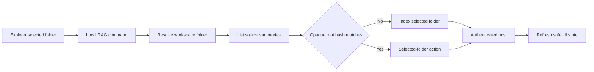

# ADR-005: VS Code Explorer Source Controls

Status: Accepted
Date: 2026-07-23
Related Features: [FEATURE-06: VS Code Search Experience](../04-FEATURE/FEATURE-06-VSCODE-SEARCH-EXPERIENCE.md)
Related Plan: [PLAN-02: Phase 2 Retrieval Quality and Operational Hardening](../03-PLAN/PLAN-02-PHASE2-RETRIEVAL-QUALITY-OPERATIONAL-HARDENING.md)
Related Design: [DESIGN.md Sections 3.3 and 5.1](../01-DESIGN/DESIGN.md)
Supersedes: none
Superseded by: none
Decision authorization: Accepted under the user's explicit `FEATURE-06 -Force write/approve required ADRs` direction on 2026-07-23. The user separately authorized the FEATURE-06 search/context implementation without ADR-004; that exception is recorded in FEATURE-06 and does not claim FEATURE-04 is complete.

---

## Implementation plan (step-by-step)

- [x] Map the existing VS Code command, source-state, and authenticated source-route behavior.
- [x] Define the selected-folder boundary, non-secret state rule, and Explorer submenu interaction.
- [x] Add URI-targeted Index, Toggle, Refresh Index, and Source Status command handlers plus command/menu tests.
- [x] Run extension compile/test/package smoke and record evidence. No host regression was required because this slice uses unchanged authenticated source routes.
- [x] Implement the user-authorized search/context view against the existing authenticated host contract; mode/filter/diagnostic contract expansion remains separate work.

---

## Context

The extension already exposes one top-level Explorer command, `localRag.markAsSource`. It resolves the clicked folder, fetches registered source summaries, compares the opaque `rootPathHash`, and either registers the selected folder or removes the matching source. Reindex and status commands instead use a source Quick Pick and can therefore target a different source than the clicked folder.

FEATURE-06 needs an explicit interaction and state-retention decision before it is ready. The menu must be useful in a multi-root workspace without sending canonical paths back from the host, deleting an arbitrary source, storing query/source content, or pretending that VS Code `when` clauses can synchronously know backend index state.

This ADR governs existing source-lifecycle controls. The user separately authorized the FEATURE-06 search/context implementation without ADR-004; that exception uses the existing authenticated host contracts and is recorded in FEATURE-06 rather than silently changing this ADR's source-control decision.

Goals:

- make source control discoverable as `Right click local workspace folder (including its root) -> Local RAG`;
- bind every Explorer mutation to the selected folder's current opaque source identity;
- offer a small, predictable menu: `Index Folder`, `Refresh Index`, `View Status`, and `Turn Indexing On/Off`;
- retain only existing non-secret UI decoration/preference state; and
- preserve backend-owned authorization, canonicalization, and path privacy.

Non-goals:

- bypassing FEATURE-04 or exposing the planned source-scoped search view;
- arbitrary path deletion, source-file changes, or management/reset operations;
- persisting query history, result/context content, credentials, or canonical roots; and
- deriving menu visibility from stale local source state.

---

## Stakeholders

| Role | What they need to know | Questions this ADR answers |
| --- | --- | --- |
| Product / Owner | A compact right-click experience | What does each action do? |
| Engineering | Handler and state boundaries | How is the selected folder kept authoritative? |
| QA | Observable command/menu behavior | Which success, denied, and stale cases must pass? |

---

## Decision

Create a prominent `Local RAG` Explorer submenu for local folders. Commands receive the Explorer URI, resolve it to a workspace folder, refresh the backend source list, and then act only on the matching opaque source ID. The host remains authoritative for canonicalization, registration, reindex queueing, deletion, and status. A single Explorer view named `LOCAL RAG` combines backend-authoritative indexed-folder display names/safe statuses with search results; it does not show canonical roots or duplicate source mutations.

Key points:

- The Explorer contribution requires both `resourceScheme == file` and VS Code's Explorer-specific `explorerResourceIsFolder` context key; each handler independently verifies the selected URI is a directory before any host call. File selections are refused with an explanatory message.
- `Index Folder` registers the selected folder when absent; if already indexed it reports that state and offers no implicit deletion. It never cleans up a same-named stale source as a side effect; stale-source removal remains an explicit source-management action.
- `Turn Indexing On/Off` is the intentionally compact shortcut: it registers an absent folder and, after an explicit confirmation, removes only the freshly matched selected-folder source. Its neutral label does not pretend to know asynchronous backend state before invocation.
- `Refresh Index` reindexes only the freshly matched selected-folder source; an absent folder receives a safe prompt to index first.
- `Source Status` shows only the freshly matched selected-folder status; it never falls back to a different Quick Pick selection.
- Static VS Code menu conditions limit the submenu to local file/folder resources. They do not claim to know asynchronous backend state.
- The submenu uses a stable early navigation group; folder commands carry Local RAG command-palette categories and product icons so the same actions remain recognizable outside the context menu.
- Existing decoration/global-state data stays versioned, non-secret, and limited to source summaries/opaque hashes. Query, content, credentials, and canonical roots are not persisted.
- The `LOCAL RAG` Explorer view is a read-only projection of those existing safe source summaries plus the current search result list. It refreshes indexed folders when source state is refreshed and displays explicit empty-state rows for indexing and search.

---

## Diagram

---

## Alternatives considered

### Keep one top-level toggle command

- Pros: no implementation work.
- Cons: poor discoverability, ambiguous destructive behavior, and no URI-targeted reindex/status action.
- Rejected because FEATURE-06 needs an approved, testable interaction boundary.

### Drive menu state from cached decorations

- Pros: could show different labels without a request.
- Cons: stale after another client changes source state and cannot safely authorize mutation.
- Rejected because the backend source list must remain authoritative.

### Put source removal or reset in the submenu without confirmation

- Pros: fewer clicks.
- Cons: makes an irreversible source-registry mutation too easy and could widen FEATURE-09 management scope.
- Rejected because removal needs explicit confirmation and reset remains management-only.

---

## Consequences

### Positive

- The common selected-folder workflow is clear and multi-root-safe.
- Every action can be covered by a URI-targeted command test and a source-route assertion.
- The design reuses existing authenticated host operations and opaque path hashes.

### Negative / risks

- A source-list refresh adds one request per command.
- The command label cannot exactly mirror backend state before invocation.
- Mitigation: bounded source summaries, explicit status messages, and fresh identity lookup before mutation.

---

## Impact

### Code

- `src/vscode-extension/package.json`: submenu and URI-capable command contributions.
- `src/vscode-extension/src/extension.ts`: selected-folder command helpers and confirmation behavior.
- `src/vscode-extension/test/`: command/menu tests with fake VS Code and client seams.
- No new host API, schema, secret, or telemetry field is required.

### Data / configuration

- Existing non-secret source-summary decoration state may continue to contain opaque root hashes and safe status fields.
- No new persisted preference, configuration key, or migration is introduced.

### Documentation

- Update FEATURE-06 and PLAN-02 with the accepted interaction decision and verification mapping.
- Update user documentation when the commands are implemented and verified.

---

## Verification

### Objectives

- Prove every Explorer action uses the selected URI and never a different Quick Pick source.
- Prove fresh source matching prevents arbitrary-delete navigation.
- Prove index, toggle confirmation, missing-source, backend error, and multi-root cases have safe user-visible results.
- Prove no query/content/credential/canonical-root state is persisted or logged.

### Test environment

- Extension: Node.js 22+, VS Code command/client seams, deterministic source summaries.
- Host: authenticated test host with disposable source registry; live host smoke only after the broader feature gate is resolved.

### Test commands

- build: from `src/vscode-extension`, `npm run compile`; host: `dotnet build .\\LocalRag.sln -c Release`.
- test: from `src/vscode-extension`, `npm test`; host: `dotnet test .\\LocalRag.sln -c Release`.
- format: from extension, `npm run lint`; host: `dotnet format .\\LocalRag.sln --verify-no-changes`.
- package: from extension, `npm run package`.

### New or changed tests

| ID | Scenario | Level | Expected result | Notes |
| --- | --- | --- | --- | --- |
| POS-06-004 | Index clicked unregistered folder | Unit/UI seam | POST uses only resolved selected folder | Multi-root fixture |
| POS-06-005 | Refresh clicked indexed folder | Unit/UI seam | Reindex uses only matching opaque source ID | Fresh source list |
| NEG-06-004 | Toggle removal is cancelled | Unit/UI seam | No DELETE occurs | Confirmation fixture |
| NEG-06-005 | Clicked folder has no match for refresh/status | Unit/UI seam | No arbitrary action; safe prompt | Stale state fixture |
| NEG-06-006 | Explorer selection is a file | Unit/UI seam | No host mutation; clear folder-only message | File URI fixture |
| EDGE-06-004 | Source list changes between clicks | Unit/UI seam | Fresh match is used or action is safely refused | Deferred client fixture |

### Regression and analysis

- Run existing extension source-state tests and host source-route tests.
- Inspect command/menu contributions and packaged VSIX contents.
- Live E2E and authorization-migration checks remain unverified because the local Weaviate/ONNX environment and FEATURE-04 migration are outside this implemented slice; do not record them as passed.

### Implementation evidence (2026-07-23)

- `src/vscode-extension/src/extension.ts` now resolves Explorer actions through a folder-only guard, refreshes source state before matching `rootPathHash`, and scopes index/toggle/refresh/status to that selected folder without cross-folder stale cleanup.
- `src/vscode-extension/package.json` contributes the `Local RAG` submenu and preserves `localRag.markAsSource` as the compatibility alias.
- From `src/vscode-extension`, `npm.cmd test` passed: 22 tests, 0 failures. The suite covers folder-only menu contribution, selected-folder mutation paths, directory and real-path guards, stale-search protection, and bounded provenance-validated context copy.
- From `src/vscode-extension`, `npm.cmd run package` passed and produced `local-rag-0.1.0.vsix`; VSCE reported only missing `repository` and license metadata warnings.
- `SearchApiRequest`, `SearchRequest`, `RagSearchService`, and `WeaviateVectorStore` now carry validated mode/language/path filters; the host Release suite passed 142 tests with 4 opt-in live-dependency skips.
- Folder-context revamp: a live VS Code child-folder inspection found that the generic `resourceIsFolder` key did not make the submenu visible. The contribution now uses the documented Explorer-specific `explorerResourceIsFolder` key while retaining the independent handler directory guard. Package-level tests verify the local-folder condition, early navigation placement, command order, plain-language labels/icons/categories, and the single `LOCAL RAG` view wiring. `npm.cmd test` passed 24 tests; lint, `git diff --check`, and VSIX packaging passed. The packaged `local-rag-0.1.0.vsix` was inspected to confirm its one `LOCAL RAG` view, folder-only submenu condition, and view-title search action.

---

## Rollout and migration

- Additive extension-only contributions; no data migration.
- Preserve `localRag.markAsSource` as a compatibility alias until documentation and package consumers move to the new submenu commands.
- Remove or revise the alias only in a separately reviewed compatibility change.

---

## References

- [FEATURE-06](../04-FEATURE/FEATURE-06-VSCODE-SEARCH-EXPERIENCE.md)
- [PLAN-02](../03-PLAN/PLAN-02-PHASE2-RETRIEVAL-QUALITY-OPERATIONAL-HARDENING.md)
- [ADR-004: Contextual Retrieval Ranking and Reranking](ADR-004-contextual-retrieval-ranking-and-reranking.md)
- `src/vscode-extension/src/extension.ts`
- `src/vscode-extension/package.json`

---

## Filing checklist

- [x] File saved under `.swe/02-ADR/ADR-005-vscode-explorer-source-controls.md`.
- [x] Status is Accepted with explicit user authorization recorded.
- [x] Links to related feature, plan, tests, and ADRs are filled in.
- [x] Diagram section contains Mermaid.
- [ ] DESIGN.md updated if the broader search-view module boundary changes.
