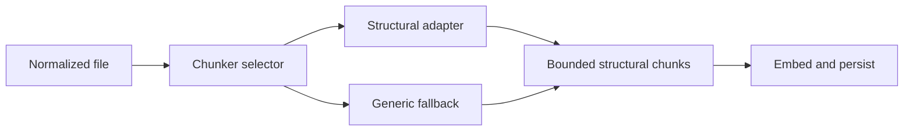

# Feature: Language-Aware Structural Chunking

Links:
Plan: [.swe/03-PLAN/PLAN-02-PHASE2-RETRIEVAL-QUALITY-OPERATIONAL-HARDENING.md](../03-PLAN/PLAN-02-PHASE2-RETRIEVAL-QUALITY-OPERATIONAL-HARDENING.md)
Modules: `src/LocalRag.Host/Application`, `src/LocalRag.Host/Domain`, `src/LocalRag.Host/Infrastructure/Processing`, SQLite state, Weaviate schema
ADRs: [ADR-001: Language-Aware Structural Chunking](../02-ADR/ADR-001-language-aware-structural-chunking.md) is Accepted and is the governing chunking/versioning/evaluation decision.

---

## Implementation plan (step-by-step)

- [x] Approve the Phase 2 language corpus, parser strategy, chunk metadata, versioning, and evaluation threshold through ADR-001.
- [x] Extend chunk contracts and persistence with chunk kind, qualified symbol, structural locator, and chunker identity/version.
- [x] Add a chunker selector/composite and retain `GenericChunker` as the mandatory fallback.
- [x] Implement the approved structural chunkers in smallest-language increments with golden fixtures.
- [x] Add deterministic oversized-symbol splitting and token-window enforcement.
- [x] Add/update automated tests for every positive, negative, and edge scenario below.
- [x] Run build, test, format, live-inference, live-Weaviate, and retrieval-evaluation commands; record results.
- [x] Update schema/migration, configuration, architecture, and supported-language documentation.

---

## Purpose

Produce higher-quality searchable chunks that preserve meaningful swe/configuration boundaries and provenance, while remaining deterministic, bounded, and safe when parsing is unsupported or fails.

---

## Stakeholders (who needs this to be clear)

| Role            | What they need from this spec                                                         |
| --------------- | ------------------------------------------------------------------------------------- |
| Product / Owner | Approved language scope and measurable retrieval-quality threshold                    |
| Engineering     | Parser/selector interfaces, stable identities, migrations, and fallback rules         |
| DevOps / SRE    | Reindex/version transition, resource bounds, and diagnostics                          |
| QA              | Golden structural fixtures, malformed inputs, token boundaries, and evaluation corpus |

---

## Scope

### In scope

- An approved Phase 2 language corpus selected before Ready status.
- Structural units for classes, methods, functions, interfaces, modules, and logical documentation/configuration sections where supported.
- Additive chunk provenance: kind, symbol, qualified symbol, structural locator, chunker ID/version.
- Deterministic splitting of oversized units, generic fallback, persistence/schema changes, and retrieval evaluation.

### Out of scope

- Compiler-grade semantics, Tree-sitter dependency analysis, call graphs, parent-child retrieval, and Git-aware metadata.
- New embedding profiles or new document extractors.
- Treating guessed parser output as authoritative when parsing fails.

---

## Business Rules

- R2.1-structural_units: preserve a complete structural unit when it fits the hard model/token limit.
- R2.1-provenance: every chunk records exact line bounds and versioned structural provenance; absolute paths remain internal.
- R2.1-fallback: unsupported, malformed, or unavailable parsers fall back to generic line-preserving chunks without dropping content.
- Oversized units split deterministically into bounded signature/continuation sections while preserving ordering and lineage.
- Same source, normalized path, structural locator, content, and chunker version produce the same identity.
- A chunker contract/version change creates explicit reindex work and cannot silently mix incompatible metadata.
- All parsed/extracted content remains untrusted data and does not influence authorization or tool behavior.

---

## User Flows

### Primary flows

1. Structural file indexing
   - Actor: Indexing service
   - Trigger: A supported file is new or content-hash changed.
   - Steps: Select adapter; parse bounded structure; emit chunks and provenance; embed changed chunks; persist/upsert atomically.
   - Result: Search can return stable symbol-level results with exact line ranges.
2. Generic fallback
   - Actor: Indexing service
   - Trigger: Language is unsupported or structural parsing fails safely.
   - Steps: Record a bounded diagnostic; invoke `GenericChunker`; continue normal persistence.
   - Result: File remains searchable without unsupported structural claims.

### Edge cases

- Empty or comment-only file → no blank chunks; status remains successful.
- Malformed syntax → generic fallback, not partial corrupt structural metadata.
- One symbol exceeds maximum tokens → deterministic bounded continuations.
- Mixed line endings or encoding normalization → original indexed line mapping remains correct.
- Chunker version changes → controlled reindex with no mixed-version query ambiguity.

---

## System Behaviour

- Entry points: `FileIndexingService.IndexAsync` through an `IChunker` selector/composite.
- Reads from: normalized extractor output, source/file metadata, chunking configuration, tokenizer/model limits.
- Writes to: SQLite file/chunk state and Weaviate chunk objects through existing application/infrastructure boundaries.
- Side effects / emitted events: indexed/skipped/fallback counters and safe parser diagnostics.
- Idempotency: Yes; deterministic locators, identities, versions, and upsert semantics.
- Error handling: configuration errors fail readiness; per-file parser errors fall back or dead-letter according to classified severity.
- Security / permissions: no new endpoint; absolute roots and source content remain governed by existing indexing/security policy.
- Feature flags / toggles: structural chunking is enabled only for approved adapters; fallback is always enabled.
- Performance / SLAs: bounded parsing; no unbounded syntax trees; Phase 2 search/indexing targets remain applicable.
- Observability: chunk count/kind, parser version, duration, fallback/failure category, never full content.

---

## Diagrams

---

## Verification

### Test environment

- Environment / stack: .NET test host, disposable SQLite, approved language fixtures, real ONNX and live external Weaviate for release evidence.
- Data and reset strategy: checked-in golden fixtures plus clean temporary source/database/collection per test run.
- External dependencies: real BGE ONNX assets and external Weaviate for integration/evaluation; deterministic fakes only for unit isolation.

### Test commands

- build: `dotnet build .\LocalRag.sln -c Release`
- test: `dotnet test .\LocalRag.sln -c Release`
- format: `dotnet format .\LocalRag.sln --verify-no-changes`
- coverage: `dotnet test .\LocalRag.sln -c Release --no-build --no-restore --collect:"Code Coverage;Format=Cobertura" --results-directory artifacts/coverage-cobertura`

### Test flows

**Positive scenarios**

| ID         | Description                               | Level (Unit / Int / API / UI) | Expected result                                             | Data / Notes                      |
| ---------- | ----------------------------------------- | ----------------------------- | ----------------------------------------------------------- | --------------------------------- |
| POS-01-001 | Supported nested structural units         | Unit                          | Stable chunks preserve units, symbols, and exact lines      | One fixture per approved language |
| POS-01-002 | Structural metadata persists and searches | Integration                   | SQLite/Weaviate/result contracts retain approved provenance | Real Weaviate                     |
| POS-01-003 | Reindex identical file/version            | Integration                   | Same identities; no unchanged re-embedding                  | Recording/real embedding counts   |

**Negative scenarios**

| ID         | Description                                     | Level (Unit / Int / API / UI) | Expected result                                  | Data / Notes                    |
| ---------- | ----------------------------------------------- | ----------------------------- | ------------------------------------------------ | ------------------------------- |
| NEG-01-001 | Parser emits invalid bounds or over-limit chunk | Unit                          | Output rejected/bounded; no corrupt persistence  | Faulting adapter                |
| NEG-01-002 | Unsupported or malformed input                  | Integration                   | Generic searchable fallback with safe diagnostic | Invalid syntax/binary-like text |

**Edge cases**

| ID          | Description                               | Level (Unit / Int / API / UI) | Expected result                                         | Data / Notes               |
| ----------- | ----------------------------------------- | ----------------------------- | ------------------------------------------------------- | -------------------------- |
| EDGE-01-001 | Oversized structural unit                 | Unit                          | Deterministic signature/continuations within hard limit | Boundary tokenizer fixture |
| EDGE-01-002 | Empty/comment-only/mixed-line-ending file | Unit                          | No blank chunks and correct line mapping                | Encoding/line fixtures     |
| EDGE-01-003 | Chunker version transition                | Integration                   | Explicit reindex; no mixed incompatible results         | Old/new version seed       |

### Test mapping

- Integration tests: persistence/schema, reindex behavior, real vector search, adapter/fallback parity.
- API tests: additive search-result structural metadata and redaction.
- UI / E2E tests: result navigation uses returned relative path/line range.
- Unit tests: selector, every adapter, fallback, identity, token bounds, malformed inputs.
- Static analysis: `dotnet format` verification and solution build warnings policy.

### Non-functional checks

- Performance / load: parse and index the approved representative repository within the Phase 2 throughput/memory bounds.
- Security / privacy: verify no absolute roots/full content in diagnostics and no parser-driven authorization behavior.
- Observability: assert parser/chunker version, duration, fallback, and failure metrics.

---

## Definition of Done

- Behaviour matches R2.1 rules and flows in this document.
- All test flows above are covered by automated tests and the approved retrieval evaluation.
- Static analysis passes with no new unresolved issues.
- Test/build/live-dependency commands run clean locally and in CI; skipped live tests cannot satisfy release evidence.
- Schema/reindex compatibility and rollback/repair guidance are documented.
- Documentation is updated: feature, plan, design/ADR if decisions changed, supported languages, and configuration.
- Feature flags/migrations are rolled out or cleaned up, and PLAN-02/FEATURE-01 review evidence is recorded.

### Completion evidence (2026-07-21)

- Release build: succeeded with zero warnings and zero errors.
- Deterministic local suite: 92 passed, 3 explicitly skipped external tests, 0 failed in three consecutive full-suite runs. The machine-readable coverage summary is [feature-01-coverage.json](../../artifacts/evaluation/feature-01-coverage.json).
- Live suite: 95 passed, 0 skipped, and 0 failed with the real BGE ONNX model and external Weaviate at `127.0.0.1:8080`.
- Paired retrieval evaluation: 24 checked-in files, 32 natural queries, eight reported families, clean isolated collections, fixed path/span qrels, and deterministic top-10 ranking. Candidate Recall@10 was 1.0000, MRR@10 was 0.9193, and nDCG@10 was 0.9394 versus the generic baseline's 0.8382, a 12.08% improvement with no family regression beyond 0.02. The auditable report is [feature-01-retrieval.json](../../artifacts/evaluation/feature-01-retrieval.json).
- Performance evidence: repeated 24-file sequential ONNX/Weaviate runs measured about 3.3 files/second, below the 10 files/second design target, while sustaining roughly 17 chunks/second with candidate per-file p95 below 0.55 seconds, search p95 below 14 ms, and peak working set below 607 MB. The solution architect approved a bounded Feature 01 performance exception on 2026-07-21. The report times normalized-content chunking, embedding, and vector upsert together, binds the current worktree/evaluator hashes, and enforces latency plus a 1 GiB peak-working-set ceiling. This exception applies only to Feature 01 evaluation and does not waive the PLAN-02 release performance gate; batching and full detection/extraction-to-index throughput remain follow-up performance work.
- Static analysis and clients: `dotnet format --verify-no-changes`, VS Code TypeScript lint, and all seven extension tests passed.
- Security/observability: REST/MCP serialization asserts relative paths plus all additive provenance without absolute roots; chunking metrics assert bounded `chunker.id`, `chunker.version`, and `chunking.outcome` tags without content or path values.
- Regression fixtures: DOCX and PDF indexing remain covered; the exact synthetic image-only OCR PDF is visually verified and its extracted sentinel is asserted.
- Residual limitation: the approved adapters are conservative bounded lexical parsers rather than compiler-grade parsers; malformed or ambiguous input intentionally uses versioned generic fallback.
- Review disposition: independent solution-architecture, implementation/code, and test/evidence reviews all returned `APPROVED`; the solution architect also approved the ADR implementation amendment and the bounded Feature 01 performance exception.

---

## References

- Plan: [.swe/03-PLAN/PLAN-02](../03-PLAN/PLAN-02-PHASE2-RETRIEVAL-QUALITY-OPERATIONAL-HARDENING.md)
- Architecture: [.swe/01-DESIGN/DESIGN.md](../01-DESIGN/DESIGN.md)
- Code: `src/LocalRag.Host/Infrastructure/Processing/GenericChunker.cs`, `Application/Contracts.cs`, `Domain/Models.cs`
