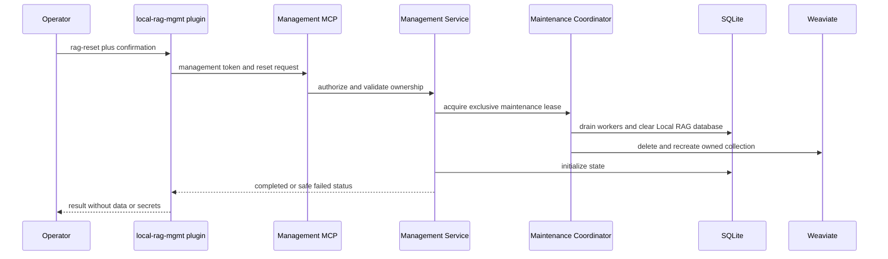

# Feature: Local RAG Management Plugin and Host Management API

Links:
Plan: [.swe/03-PLAN/PLAN-02-PHASE2-RETRIEVAL-QUALITY-OPERATIONAL-HARDENING.md](../03-PLAN/PLAN-02-PHASE2-RETRIEVAL-QUALITY-OPERATIONAL-HARDENING.md) (explicit scope exception)
Modules: `plugins/local-rag-mgmt/`, `src/LocalRag.Host/`, and `tests/LocalRag.Host.Tests/`
ADRs: [.swe/02-ADR/ADR-002-durable-reconciliation-state-and-watcher-recovery.md](../02-ADR/ADR-002-durable-reconciliation-state-and-watcher-recovery.md) and [ADR-003: Local Management and Destructive Reset](../02-ADR/ADR-003-local-management-and-destructive-reset.md)

---

## Implementation plan (step-by-step)

- [x] Accept ADR-003 for local management authentication, confirmation binding, dedicated-Weaviate ownership, reset recovery, and the Phase 2 scope exception.
- [x] Create `plugins/local-rag-mgmt/.codex-plugin/plugin.json`, a management MCP declaration, and the three skill folders.
- [x] Add an isolated privileged management boundary to `LocalRag.Host` without adding mutation tools to `RagMcpTools` or `/mcp`.
- [x] Reuse the existing registration/index and fenced removal services through a new path-oriented management application service.
- [x] Add an exclusive host-maintenance coordinator and reset-capable SQLite and Weaviate infrastructure operations.
- [x] Implement `rag-reset` only after confirmed maintenance entry, full quiescence, reset completion, schema recreation, and readiness recovery.
- [x] Add mapped automated tests and record build/test/format/coverage evidence.

---

## Purpose

Deliver a `local-rag-mgmt` Codex plugin that operates through a narrowly privileged LocalRag.Host management API. The plugin lets a local operator index a folder, remove the index for a folder, or intentionally reset all Local RAG SQLite data and application-owned Weaviate data. It complements, rather than alters, the existing read-only Local RAG plugin and MCP endpoint.

---

## Stakeholders (who needs this to be clear)

| Role | What they need from this spec |
| --- | --- |
| Product / Owner | Exact reset blast radius and confirmation behavior. |
| Codex-plugin engineering | Manifest, management MCP connection, skill contracts, and user-facing warnings. |
| Host engineering | API/application/infrastructure changes that reuse current lifecycle and vector boundaries. |
| DevOps / SRE | Loopback-only enablement, recovery after partial reset, and safe diagnostics. |
| QA | Isolated plugin-to-host flows covering normal, refusal, and concurrency cases. |

---

## Scope

### In scope

- New `plugins/local-rag-mgmt/` plugin containing `rag-index <folder_path>`, `rag-remove-index <folder_path>`, and `rag-reset` skills, plus a dedicated management MCP server declaration using `LOCALRAG_MANAGEMENT_TOKEN`.
- A separate authenticated LocalRag.Host management endpoint/tool set, path-to-source resolution, confirmation enforcement, and reset-operation status.
- Reuse of `ISourceRegistry.RegisterAsync`, `IIndexCoordinator.QueueInitialIndexAsync`, and `IIndexCoordinator.RemoveSourceAsync` for normal indexing/removal.
- A global maintenance fence that coordinates existing watchers, reconciliation scheduler/dispatcher/workers, source-operation gates, SQLite, and `IVectorStore` during reset.
- Reset of the host's exact `localrag.db` database plus WAL/SHM sidecars and the configured Local RAG Weaviate collection, followed by schema/state initialization.

### Out of scope

- Source-file deletion or mutation; indexing reads eligible files only.
- Adding management capabilities to `RagMcpTools` or the existing `/mcp` endpoint, or changing the existing read-only `local-rag-skills` plugin.
- Resetting a remote, shared, non-loopback, or ownership-unverified Weaviate endpoint; deleting arbitrary Weaviate collections; starting/stopping Docker or Weaviate.
- Backups, undo, multi-user/remote administration, and automatic retry of a reset request.

---

## Business Rules

- **R2.9-plugin_layout:** `plugins/local-rag-mgmt/.codex-plugin/plugin.json` declares a distinct plugin named `local-rag-mgmt`; its `.mcp.json` connects only to the host's separate management MCP path and uses `LOCALRAG_MANAGEMENT_TOKEN`, never `LOCALRAG_MCP_TOKEN`.
- **R2.9-index_contract:** `rag-index <folder_path>` calls `rag_index` on the management MCP surface. The host canonicalizes the path exactly as `SqliteSourceRegistry.RegisterAsync` does, validates it is an accessible directory, and invokes the existing registration plus `QueueInitialIndexAsync` path. An already registered or overlapping root returns a bounded conflict/no-op result and creates no duplicate source.
- **R2.9-remove_contract:** `rag-remove-index <folder_path>` calls `rag_remove_index`. The host resolves only an exact canonical root internally, requires a confirmation bound to that operation and canonical root, then calls existing `IndexCoordinator.RemoveSourceAsync`. The existing tombstone, per-source operation gate, watcher untracking, vector deletion, and SQLite cleanup remain the only removal path.
- **R2.9-reset_contract:** `rag-reset` calls `rag_reset` and requires a fresh reset-specific confirmation. On success there are no registered sources, files, chunks, jobs, recovery rows, dead letters, profile rows, or Local RAG vectors/objects. Source files, model assets, host configuration, and unrelated Weaviate collections remain untouched.
- **R2.9-management_auth:** Management requests require a separate local bearer token and an explicit `LocalRag:Management:Enabled=true` setting. The current `LocalTokenAuthenticationHandler` remains valid only for standard REST/MCP operations and must not authorize management routes/tools.
- **R2.9-local_ownership:** Reset is permitted only when the endpoint parses as loopback HTTP(S), the configured collection equals the host-owned collection, and a host-created ownership marker validates that collection. Missing/invalid evidence, remote DNS names, or a shared marker fail closed before any delete request.
- **R2.9-reset_fence:** Reset acquires an exclusive maintenance lease, blocks new register/reindex/remove and index work, cancels/drains active workers, and prevents stale worker completion after the lease generation changes. It returns `ResetInProgress` for concurrent management requests.
- **R2.9-safe_results:** Plugin and host results/logs expose only operation ID, state, bounded counts, and safe error code. They do not reveal bearer tokens, raw errors, source content, canonical paths, or connection strings.

---

## User Flows

### Primary flows

1. Index folder
   - Actor: Local Codex operator.
   - Trigger: `rag-index <folder_path>`.
   - Steps: The plugin calls management MCP; the host authenticates the management token, canonicalizes/registers the root through `ISourceRegistry`, queues initial indexing through `IIndexCoordinator`, and returns source ID/status.
   - Result: Existing host indexing pipeline runs; no plugin-side database/vector access occurs.

2. Remove folder index
   - Actor: Local Codex operator.
   - Trigger: `rag-remove-index <folder_path>` and a matching confirmation.
   - Steps: The host finds the exact internal canonical root, tombstones it, cancels/fences work, untracks the watcher, deletes only that source's vectors, and removes scoped SQLite records.
   - Result: The index is removed without deleting the folder or its files.

3. Reset Local RAG
   - Actor: Local Codex operator.
   - Trigger: `rag-reset` and a reset-specific confirmation.
   - Steps: The host verifies management enablement and dedicated local ownership, takes maintenance exclusive access, drains/cancels workers, deletes the known SQLite database/WAL/SHM files, deletes only the owned Weaviate collection, initializes SQLite/schema, releases maintenance, and returns a bounded terminal status.
   - Result: Local RAG is empty and ready for registration, or it stays unavailable/not-ready with a recoverable reset failure.

### Edge cases

- Equivalent path spellings or an existing/overlapping root -> registration returns safe conflict/idempotent status without a duplicate source.
- File, absent root, inaccessible root, or non-directory path -> `rag-index` performs no write and returns validation failure.
- Unregistered folder, mismatched confirmation, or expired confirmation -> `rag-remove-index` performs no deletion.
- Active indexing/reconciliation during remove/reset -> fencing cancels it; stale lease completion cannot recreate data.
- Weaviate failure after SQLite clear -> the host remains not-ready/maintenance-failed, emits no success, and requires an explicit later reset/recovery action.

---

## System Behaviour

### Current facts and proposed touchpoints

| Area | Current implementation | Proposed feature change |
| --- | --- | --- |
| Standard host API | `src/LocalRag.Host/Program.cs` exposes authenticated `POST /api/v1/sources`, `DELETE /api/v1/sources/{sourceId}`, and reindex routes. | Keep unchanged; add separately authorized `/api/v1/management` routes and a separate management MCP mapping. |
| MCP | `src/LocalRag.Host/Api/RagMcpTools.cs` is read-only at `/mcp`. | Add `Api/RagManagementMcpTools.cs` on a distinct management path; do not add mutation methods to `RagMcpTools`. |
| Registration/removal | `SqliteSourceRegistry.RegisterAsync` canonicalizes/validates roots; `IndexCoordinator.RemoveSourceAsync` tombstones, fences, untracks, deletes vectors, then removes state. | Add `ILocalRagManagementService` to resolve canonical root internally and delegate to those existing services. |
| SQLite | `SqliteDatabase` owns `%LOCALAPPDATA%\\LocalRag\\localrag.db` and opens WAL-mode connections. | Add a reset-capable database coordinator that deletes only that known database and sidecars while maintenance exclusive access is held, then re-runs existing initializers. |
| Weaviate | `WeaviateVectorStore` owns one configured collection and supports readiness/schema creation and source-scoped deletion. | Extend `IVectorStore` with collection ownership verification and owned-collection deletion/recreation; never expose generic collection deletion. |
| Authorization/configuration | `AuthenticationOptions` contains one standard token and `LocalRagOptionsValidator` validates operating settings. | Add `ManagementOptions` (`Enabled`, token reference, confirmation TTL, local-ownership requirement), validation, a dedicated authentication scheme/policy, and disabled-by-default behavior. |
| Concurrency/readiness | Per-source `SourceOperationGate`, reconciliation leases, hosted workers, SQLite/Weaviate health checks. | Add `HostMaintenanceCoordinator` shared by API, scheduler, worker, and management service; maintenance forces readiness failure until reset initialization completes. |
| Plugin | `plugins/local-rag-skills/` declares a read-only MCP connection using `LOCALRAG_MCP_TOKEN`. | Add isolated `plugins/local-rag-mgmt/` manifest, `.mcp.json`, three skills, and management-only agent metadata using `LOCALRAG_MANAGEMENT_TOKEN`. |

- Entry points: management MCP tools `rag_index`, `rag_remove_index`, `rag_reset`; corresponding management REST endpoints for contract/test parity.
- Idempotency: index is idempotent only for the same canonical root; remove returns `SourceNotFound` without mutation; reset is never automatically retried and always needs a new confirmation.
- Migration: add configuration/options and any reset-operation/audit schema additively; reset is the sole authorized destructive clearing action and requires no migration rollback.
- Compatibility: existing standard token, REST routes, `/mcp`, source responses, and read-only plugin behavior remain compatible. Management is opt-in and unavailable to older/standard clients.
- Rollback: disable management endpoints/plugin and preserve existing host data before a reset; reset itself is irreversible, so rollback after a successful reset restores no index data.
- Observability: management operation audit log, bounded counters/duration, maintenance state and readiness health; no high-cardinality path/content labels.

---

## Diagrams

---

## Verification

### Test environment

- Environment / stack: temporary source roots, per-test `DataDirectory`, fake management token/clock/worker seams, and a disposable dedicated Weaviate instance.
- Data and reset strategy: a test collection with a validated ownership marker; no test may target the operator endpoint or any non-loopback address.
- External dependencies: real host API/MCP contract tests and containerized Weaviate; fake vector/database tests for injected failure and fencing.

### Test commands

- build: `dotnet build .\\LocalRag.sln -c Release`
- test: `dotnet test .\\LocalRag.sln -c Release`
- format: `dotnet format .\\LocalRag.sln --verify-no-changes`
- coverage: add and run the repository's deterministic coverage command.

### Test flows

**Positive scenarios**

| ID | Description | Level | Expected result |
| --- | --- | --- | --- |
| POS-09-001 | `rag_index` indexes a valid new root | MCP/API integration | Existing registration plus initial-index queue executes once. |
| POS-09-002 | Confirmed `rag_remove_index` for a registered root | MCP/API integration | Existing fenced removal clears only source-scoped host/vector data; fixture files remain. |
| POS-09-003 | Confirmed `rag_reset` for a dedicated local instance | Host/Weaviate integration | Exact SQLite database and owned collection are recreated empty; ready health recovers. |

**Negative scenarios**

| ID | Description | Level | Expected result |
| --- | --- | --- | --- |
| NEG-09-001 | Standard token or `/mcp` invokes management tool/route | Auth contract | 401/403 or tool absence; no management mutation. |
| NEG-09-002 | Invalid path, missing source, or invalid confirmation | MCP/API | No SQLite/vector/source-file mutation occurs. |
| NEG-09-003 | Reset targets remote/shared/unowned endpoint | Integration | Host refuses before any SQLite or Weaviate delete request. |

**Edge cases**

| ID | Description | Level | Expected result |
| --- | --- | --- | --- |
| EDGE-09-001 | Equivalent path already registered | API integration | One source only; safe idempotent/conflict response. |
| EDGE-09-002 | Reconciliation worker races remove/reset | Concurrency integration | Maintenance/lifecycle fences prevent stale source or vector resurrection. |
| EDGE-09-003 | Weaviate fails after SQLite has been cleared | Fault integration | No success response; host stays not-ready until explicit recovery/reset succeeds. |

### Test mapping

- Unit: confirmation binding/expiry, canonical path matching, management-token policy, ownership predicate, and maintenance state transitions.
- API/MCP: standard versus management authorization, plugin tool schema, route/tool parity, safe response serialization.
- Integration: registration/removal delegation, SQLite reset files/initialization, collection deletion/recreation, health and observability.
- E2E: install management plugin in a local fixture, invoke each skill through its management MCP connection, and verify the standard read-only plugin has no mutation capability.
- Static analysis: Release build, formatting, and coverage.

### Non-functional checks

- Security/privacy: assert that no plugin code issues raw SQL or direct Weaviate calls, no standard token has management privileges, and logs/responses redact paths, tokens, content, and raw exceptions.
- Reliability: simulate cancellation and process restart in each maintenance phase; stale work must remain fenced and readiness must be truthful.

---

## Definition of Done

- The plugin, management MCP/API, and host services meet all `R2.9-*` rules and mapped POS/NEG/EDGE tests.
- Existing standard `/mcp`, REST source API, and `local-rag-skills` plugin remain read-only/compatible.
- Folder removal delegates to `IndexCoordinator.RemoveSourceAsync`; source files cannot be deleted by any management path.
- Reset is disabled by default, local/dedicated/owned only, confirmation-bound, globally fenced, observable, and irreversibly clears only Local RAG SQLite plus its owned Weaviate collection.
- ADR-003 is accepted before the reset feature flag is enabled.
- Build, tests, format, and coverage pass; installation/operator/recovery documentation is updated.

---

## Implementation evidence

- Implemented the disabled-by-default management configuration, distinct authentication scheme, route-filtered `/management/mcp` tools, REST contract equivalents, path-oriented management service, scoped one-use confirmations, ownership evidence, durable reset-state recovery, and readiness integration.
- The global fence covers API mutations, reconciliation scheduling/dispatch, periodic cleanup, workers, watcher callbacks, and stale worker completion. Reset untracks watchers before deleting the exact SQLite database/WAL/SHM files and resetting only the ownership-verified loopback Weaviate collection.
- Added `plugins/local-rag-mgmt/` with manually invoked `rag-index`, `rag-remove-index`, and `rag-reset` skills. Plugin contract validation passed; destructive skills require a host challenge followed by explicit user confirmation and never retry automatically.
- Verification on 2026-07-23: `dotnet build .\LocalRag.sln -c Release --no-restore` passed with 0 warnings/errors; `dotnet test .\LocalRag.sln -c Release --no-build --no-restore` passed 139, skipped 4 explicitly gated live tests, failed 0; `dotnet format .\LocalRag.sln --verify-no-changes --no-restore` passed.
- Final Cobertura evidence: [coverage report](../../artifacts/coverage-feature09-final/eaf756dc-c11a-4d0e-9d98-fb0049b21261/justin_STATION_2026-07-23.00_57_19.cobertura.xml), 75.43% line coverage (7,578/10,046) and 62.23% branch coverage (2,168/3,484).
- Independent review found and drove fixes for missing background-operation fencing, collection-deletion recovery, remote binding enforcement, and client timeout. Re-review found no remaining high/blocking issue. Existing pre-FEATURE-09 collections without an ownership marker remain intentionally fail-closed; automatic ownership adoption is not permitted.
- Live destructive reset against Weaviate was not run because the disposable external test environment was not explicitly enabled. The four gated ONNX/Weaviate/structural/live-reconciliation tests remain skipped by design.

---

## References

- [DESIGN.md](../01-DESIGN/DESIGN.md)
- [PLAN-02](../03-PLAN/PLAN-02-PHASE2-RETRIEVAL-QUALITY-OPERATIONAL-HARDENING.md) (scope exception)
- [ADR-002](../02-ADR/ADR-002-durable-reconciliation-state-and-watcher-recovery.md)
- [ADR-003](../02-ADR/ADR-003-local-management-and-destructive-reset.md)
- `src/LocalRag.Host/Program.cs`
- `src/LocalRag.Host/Application/Contracts.cs`
- `src/LocalRag.Host/Api/RagMcpTools.cs`
- `src/LocalRag.Host/Infrastructure/Indexing/IndexCoordinator.cs`
- `src/LocalRag.Host/Infrastructure/Sqlite/SqliteDatabase.cs`
- `src/LocalRag.Host/Infrastructure/Weaviate/WeaviateVectorStore.cs`
- `plugins/local-rag-skills/.codex-plugin/plugin.json`
